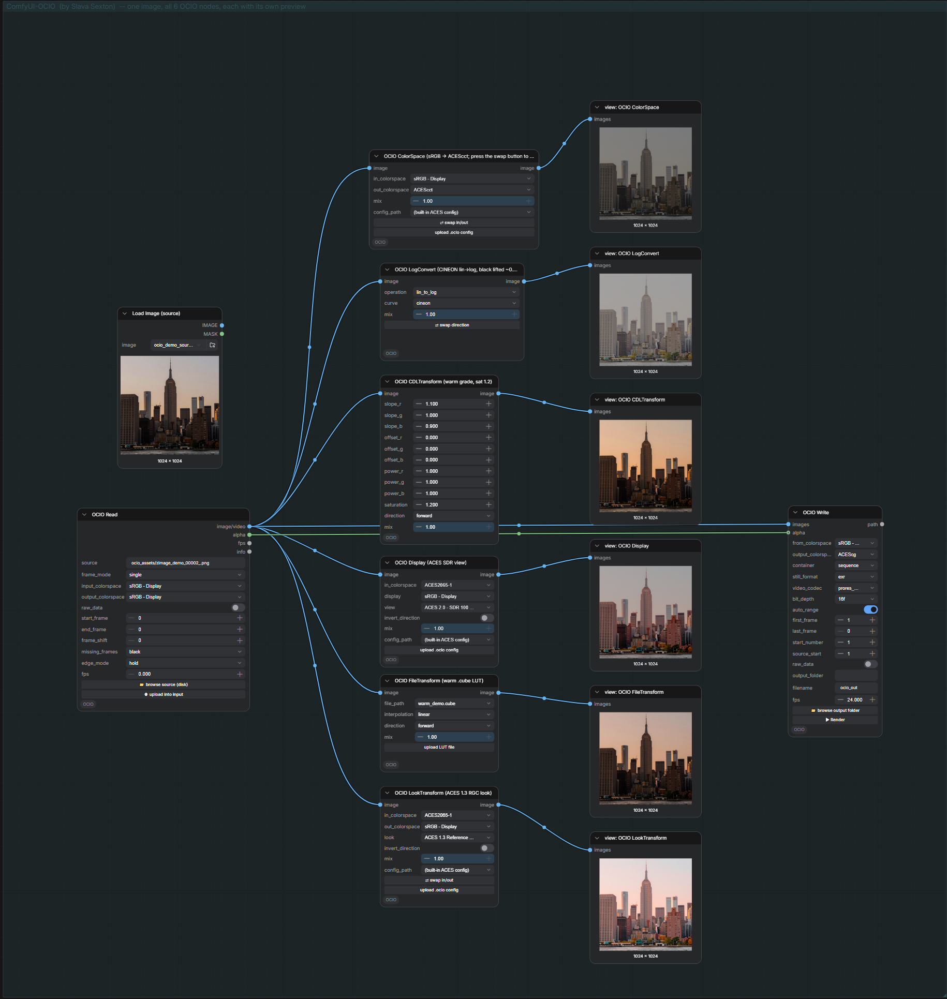
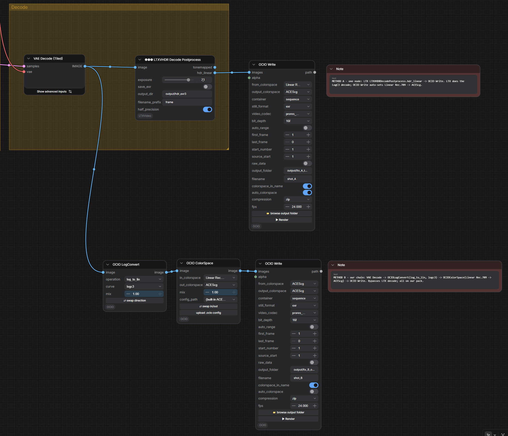

<div align="center">


# ComfyUI-OCIO

**Nuke-style OpenColorIO color nodes for ComfyUI.**
<br>
**Read a sequence, grade in ACES, write ProRes - fully color-managed.**

**By [AI VFX NEWS](https://t.me/AI_VFX_NEWS) · Slava Sexton.**


</div>

---

Eight color-management nodes for ComfyUI, modelled on **The Foundry Nuke's OCIO node set** and backed by
**OpenColorIO** with the built-in **ACES** config. Convert between colorspaces, grade with ASC CDL, apply a
display transform or a LUT, and - the two big ones - **Read** any still / image sequence / video off disk and
**Write** it back out color-managed, in EXR / TIFF / PNG / JPEG or ProRes / DNxHR / h264 / hevc.

Every node is a standard ComfyUI node (plain `IMAGE` / `MASK` / `FLOAT` / `STRING` types), so they interoperate
with the whole ecosystem: pipe **OCIO Read** into any node, and any node into **OCIO Write**.

<div align="center">



</div>

## Install

**Manual (works today):**

```bash
cd ComfyUI/custom_nodes
git clone https://github.com/SlavaSexton/ComfyUI-OCIO
pip install -r ComfyUI-OCIO/requirements.txt
```

Restart ComfyUI. The nodes appear under the **OCIO** category.

**ComfyUI Manager:** the pack ships a Comfy Registry `pyproject.toml`, so once it is published to the registry
it installs from Manager's node list. Until then, use the manual clone above.

> **EXR note.** OpenCV reads and writes EXR only when `OPENCV_IO_ENABLE_OPENEXR=1` is set in the environment
> **before** ComfyUI starts. Set it in your launcher (`set OPENCV_IO_ENABLE_OPENEXR=1` on Windows,
> `export OPENCV_IO_ENABLE_OPENEXR=1` on Linux/macOS) if you work with EXR.

## Requirements

- **OpenColorIO** (`pip install opencolorio`) - the color engine. All nodes except **OCIO LogConvert** need it.
- **OpenCV** (`opencv-python-headless`), **tifffile**, **Pillow**, **numpy** - image IO.

`requirements.txt` covers all of the Python packages above (`pip install -r requirements.txt`).

### Video and codecs (ffmpeg)

**Stills and image sequences need nothing extra** - EXR / TIFF / PNG / JPEG go through OpenCV, tifffile and
Pillow, installed by `requirements.txt`.

**Video needs ffmpeg.** ffmpeg *is* the codec engine: ProRes, DNxHR, h264 and hevc all come from it, so OCIO
Read / Write shell out to `ffmpeg` (and `ffprobe`) for any `.mov` / `.mp4`. You install it yourself, once, and
it must be a **full build** (the codecs above are only in full builds) on your system `PATH`:

- **Windows:** [gyan.dev](https://www.gyan.dev/ffmpeg/builds/) *full* build, or `winget install Gyan.FFmpeg`.
- **macOS:** `brew install ffmpeg`.
- **Linux:** `apt install ffmpeg` (or your distro's package).

Check it is found with `ffmpeg -version` in a terminal. If ffmpeg is not on `PATH`, the still/sequence nodes
still work - only the video container in OCIO Read / Write is unavailable, and it says so.

## Colorspaces, the short version

ComfyUI has no color management: it holds images as plain gamma-encoded **sRGB** in `0..1`. These nodes add the
color pipeline on top. The working space is **`sRGB - Display`** (what ComfyUI expects); **OCIO Read** converts
files *into* it and **OCIO Write** converts *out* of it. Defaults follow the file type: **EXR -> ACEScg**
(scene-linear render space), **JPEG / PNG / TIFF -> sRGB - Display**. Colorspace names come from the active OCIO
config (the built-in ACES **studio-config**, ~55 spaces including ARRI / RED / Sony camera spaces); drop a custom
`.ocio` in your input folder to use your own.

The config is **ACES 2.0**, so a few names differ from the ACES 1.x names you may know from Nuke: `Linear Rec.709
(sRGB)` is the old `Utility - Linear - sRGB`, and `ARRI LogC3 (EI800)` is `Input - ARRI - V3 LogC (EI800)`. The
whole camera set is present (ARRI LogC3 / LogC4, RED Log3G10, Sony S-Log3, Canon Log, Panasonic V-Log, Apple Log,
and more), just under the 2.0 names. Colorspace conversions match Nuke's; the display transform (OCIO Display) is
the ACES 2.0 output, which reads slightly different from an ACES 1.x setup.

---

## The eight nodes

### OCIO Read

Load a **still / image sequence / video** off disk and color-manage it on the way in (Nuke: *Read*).

- **source** - a path to a file, a sequence folder, a frame pattern (`shot.####.exr`), or a video, **anywhere on
  disk**. Use the **📁 browse source** button to pick one; **⬆ upload into input** copies files into ComfyUI's
  input folder instead.
- **frame_mode** - `auto` (a numbered file with siblings loads the whole sequence, Nuke's "grab sequence"),
  `single` (just that file), `sequence` (force-collapse the siblings). A folder is always a sequence; a video is
  always its full clip.
- **input_colorspace** - the colorspace the file *is* in. Auto-suggested by type (EXR -> ACEScg, else sRGB).
- **output_colorspace** - the working space the IMAGE comes out in (default `sRGB - Display`).
- **raw_data** - skip the conversion; pass the file's values through untouched (Nuke's *Raw Data*).
- **start_frame / end_frame** - the frame-number range to load (auto-filled to the detected range). Frames
  requested outside the range are filled by **edge_mode** (`hold` / `loop` / `bounce` / `black`).
- **frame_shift** - re-base the numbering: the number the **first** frame becomes downstream (e.g. a 1001-start
  sequence -> 1). Flows to **OCIO Write**.
- **missing_frames** - how to fill a gap *inside* the sequence (a missing frame): `black`, `hold` the previous
  frame, or `error`. Missing frames are detected automatically and listed on the node and in the `info` output.
- **fps** - taken from the video metadata (24 for stills); flows to **OCIO Write** through the wire.

**Outputs:** `image/video` (the frame batch), `alpha` (MASK, the file's alpha channel), `fps`, `info`
(frames / resolution / format / range / missing frames).

### OCIO Write

Color-manage an IMAGE batch and **write it to disk** (Nuke: *Write*).

- **from_colorspace** - the working space of the incoming image (default `sRGB - Display`).
- **output_colorspace** - the colorspace to encode into. The format picks the right default (EXR -> ACEScg,
  PNG / TIFF / JPEG -> sRGB). Written into the file metadata where the format allows it.
- **container** - `still image` (one frame), `sequence` (numbered frames), or `video`.
- **still_format** - `exr` / `tiff` / `png` / `jpeg` (used for still / sequence).
- **video_codec** - `prores_4444` / `prores_422hq` / `prores_422` / `dnxhr_hq` / `h264` / `hevc` (used for video).
- **bit_depth** - narrows to the format: JPEG 8; PNG 8 / 16; TIFF 8 / 16 / 32f; EXR 16f / 32f.
- **auto_range** - pull `first_frame` / `last_frame` / `start_number` / `fps` **automatically from the OCIO Read**
  at the other end of the wire (through any number of nodes). Edit them by hand and it turns off; turn it back on
  to re-detect.
- **first_frame / last_frame** - which frames to write. **start_number** - the number on the first output file
  (the re-base, e.g. `0086`).
- **output_folder** - where to write (**📁 browse** picks a folder on disk, or type / create one). **filename** -
  the base name; numbering and extension are added automatically.
- **alpha** (optional) - wire a MASK here to write **RGBA** (EXR / TIFF / PNG). **fps** (optional) - wire OCIO
  Read's `fps` to carry the source rate.
- **raw_data** - write the pixels as-is, skipping the conversion.

The node **previews the first written frame** in its output colorspace (a wrong colorspace pick looks visibly
wrong) and reports **"wrote N frame(s)"**. The **▶ Render** button queues the graph.

Naming: still image -> `<name>.<ext>`; sequence -> `<name>.0086.<ext>, <name>.0087.<ext>, ...`; video ->
`<name>.mov` (ProRes / DNxHR) or `<name>.mp4` (h264 / hevc).

**HDR source profiles (`profile`).** The top dropdown presets the whole node for a known HDR source.
`LTX 2.3 HDR` sets `Linear Rec.709 (sRGB) -> ACEScg`. `LumiPic LogC3 (Flux/Qwen)` and `LumiPic V10 LogC4` also
decode the log curve inside Write, so you wire a LumiPic VAE-decode plate straight in and it lands in ACEScg. Any
HDR profile forces an EXR 16f master. `auto` reads the upstream node: it detects LTX reliably, and for LumiPic it
guesses from the LoRA filename, so confirm that pick. `none` leaves the colorspaces as you set them, and editing a
colorspace by hand switches `profile` back to `none`. `Seedance 4K 10-bit` is a placeholder pending its color spec.

**Codec drives the video output.** The `video_codec` fixes the bit depth and container: ProRes 4444 is 12-bit
`.mov`, ProRes 422 / 422 HQ 10-bit `.mov`, DNxHR HQ 8-bit `.mov`, h264 and hevc 8-bit `.mp4`. The file carries the
right NCLC color tags (primaries / transfer / matrix) from `output_colorspace`, so it does not gamma-shift between
players. Video defaults to `sRGB - Display` to match the ComfyUI preview; switch it to `Rec.1886 Rec.709 - Display`
for a broadcast 2.4 master, or `Rec.2100-PQ` for HDR video.

### OCIO ColorSpace

Convert between two OCIO colorspaces (Nuke: *OCIOColorSpace*). **in_colorspace -> out_colorspace**, a **mix**
blend with the original, and an optional **config_path**. The **swap** button flips in / out in one press.

### OCIO LogConvert

Linear <-> log (Nuke: *OCIOLogConvert*), **dependency-free** (no OCIO needed). **operation** (`lin_to_log` /
`log_to_lin`), **curve**, **mix**. Curves are the published specs, verified by round-trip:

- **cineon** - Nuke's flat film log; black `0` lifts to `0.0928` (matches Nuke's default). *(default)*
- **acescct** - ACES log with a toe (black `0.0729`, S-2016-001).
- **acescc** - pure ACES log (S-2014-003).
- **logc3** - ARRI LogC3 EI800; ceiling ~55 linear. The curve LTX-2's HDR IC-LoRA uses.
- **logc4** - ARRI LogC4; wider headroom, ceiling ~469.8 linear. The curve LumiPic's V10 `*_logc4_*` HDR LoRA targets.

The **swap** button flips the direction. For **logc3 / logc4**, `log_to_lin` decodes the plate to linear; keep
the Rec.709 primaries, then convert Rec.709 -> ACEScg with **OCIO ColorSpace** (do not use a config "ARRI LogC3 /
LogC4" colorspace - that assumes ARRI Wide Gamut and would shift the gamut).

### OCIO Display

Apply a **display + view** transform (Nuke: *OCIODisplay*). **in_colorspace**, **display** and **view**
(pickers from the active config), **invert_direction**, **mix**. This is the scene-referred -> display-referred
step (e.g. ACEScg -> the ACES SDR view on an sRGB monitor).

### OCIO CDLTransform

An **ASC CDL** grade (Nuke: *OCIOCDLTransform*): **slope**, **offset**, **power** per channel (R / G / B) plus
**saturation**, a **direction** (forward / inverse), and **mix**. The industry-standard primary grade.

### OCIO FileTransform

Apply a **LUT / CCC / CDL file** (Nuke: *OCIOFileTransform*). **file_path** is a picker of LUTs in your input
folder (`.cube`, `.3dl`, `.spi1d`, `.spi3d`, `.csp`, `.ccc`, `.cdl`, `.clf`, ...); the **upload** button adds one
from your machine. **interpolation** (linear / nearest / tetrahedral / best), **direction**, **mix**.

### OCIO LookTransform

Apply an **OCIO look** (Nuke: *OCIOLookTransform*). **in_colorspace -> out_colorspace** through a named **look**
from the config (e.g. *ACES 1.3 Reference Gamut Compression*), **invert_direction**, **mix**. The **swap** button
flips in / out.

---

## Recipe: LTX-2.3 SDR-to-HDR, written as an ACEScg EXR sequence

**OCIO Write takes the LTX-2.3 HDR IC-LoRA output and writes it as an ACEScg EXR sequence.** LTX's HDR IC-LoRA
encodes the HDR range with the ARRI LogC3 curve on **Rec.709 primaries**. There are two ways to wire it to this pack.

<div align="center">



</div>

**Method A, one node (use LTX's own decoder).** LTX's `LTXVHDRDecodePostprocess` node undoes the LogC3 curve and
gives a linear-HDR `IMAGE` on its `hdr_linear` output, a plain ComfyUI `IMAGE` that pipes straight into **OCIO Write**:

```
... VAE Decode -> LTXVHDRDecodePostprocess -> (hdr_linear) -> OCIO Write
```

Wire it and OCIO Write auto-detects the LTX node upstream and sets `from_colorspace = Linear Rec.709 (sRGB)` and
`output_colorspace = ACEScg` for you (`auto_colorspace`, on by default).

**Method B, our chain (skip LTX's decoder).** Do the whole decode on this pack: tap LTX's `VAE Decode` output (the
raw LogC3 plate), run **OCIO LogConvert** (`log_to_lin`, curve `logc3`) to get linear Rec.709, then **OCIO ColorSpace**
(`Linear Rec.709 (sRGB)` -> `ACEScg`), then **OCIO Write**:

```
... VAE Decode -> OCIO LogConvert (logc3) -> OCIO ColorSpace (Rec.709 -> ACEScg) -> OCIO Write
```

Use OCIO LogConvert's **`logc3`** curve, NOT the config's "ARRI LogC3" colorspace: that one assumes ARRI Wide Gamut
primaries and would shift the gamut, but LTX keeps Rec.709.

On either OCIO Write set `container = sequence`, `still_format = exr`, `bit_depth = 16f` (the 16-bit half float LTX
targets). With `colorspace_in_name` on (default) the files come out `name_acescg.0001.exr, name_acescg.0002.exr, ...`.

Verified on a live ComfyUI: the real `LTXVHDRDecodePostprocess` `hdr_linear` -> OCIO Write path writes a two-frame
ACEScg EXR sequence with HDR values (well above 1.0) preserved; the `logc3` curve round-trips and matches LTX's own
decode to float precision. As with any EXR here, set `OPENCV_IO_ENABLE_OPENEXR=1` before ComfyUI starts.

---

## Example workflow

`example_workflows/OCIO_Nodes.json` shows all eight nodes on one image. To open it:

1. Copy `example_workflows/nyc_skyline.png` and `example_workflows/warm_demo.cube` into your **ComfyUI/input**
   folder.
2. Load `OCIO_Nodes.json` in ComfyUI and press **Queue**.

You get the source image run through each of the six color nodes (with a preview each), plus an OCIO Read ->
OCIO Write pair.

## Credits

Modelled on **The Foundry Nuke's** OCIO node set, powered by the **Academy Software Foundation's OpenColorIO**
and the **ACES** reference config. Full credits and licenses in **[ATTRIBUTION.md](ATTRIBUTION.md)**.

MIT licensed. By **[AI VFX NEWS](https://t.me/AI_VFX_NEWS)**, authored by **Slava Sexton**.
