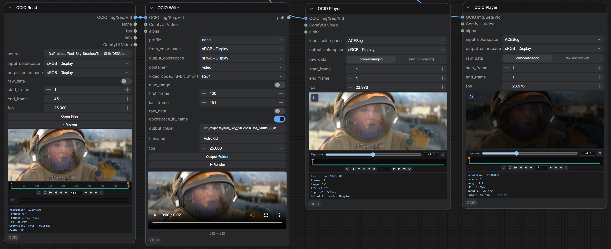
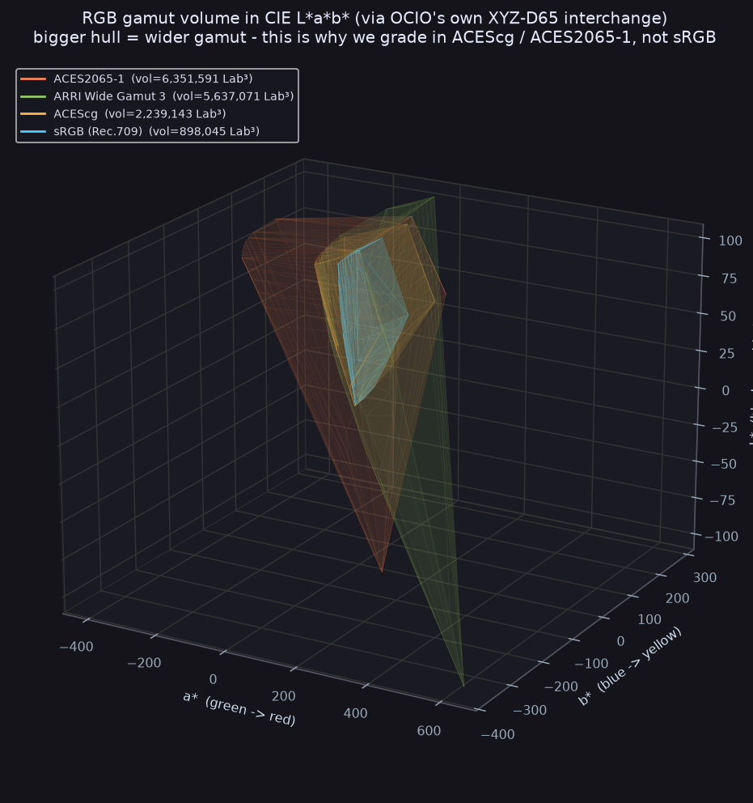

<div align="center">


# ComfyUI-OCIO

**Nuke-style OpenColorIO color nodes for ComfyUI.**
<br>
**Read a sequence, grade in ACES, write ProRes - fully color-managed.**
<br>
**Now on ComfyUI's native VIDEO wire:**
<br>
**Color-Manage HDR, LTX, Flux, Cineon and 10-bit clips inside a native video graph.**

**By [AI VFX NEWS](https://t.me/addlist/Ace2XqUflo9jYjFk) · Slava Sexton.**


</div>

---

Nine color-management nodes for ComfyUI, modelled on **The Foundry Nuke's OCIO node set** and backed by
**OpenColorIO** with the built-in **ACES** config. Convert between colorspaces, grade with ASC CDL, apply a
display transform or a LUT, scrub the result in an on-node viewer, and - the two big ones - **Read** any
still / image sequence / video off disk and **Write** it back out color-managed, in EXR / TIFF / PNG / JPEG
or ProRes / DNxHR / h264 / hevc.

Every node is a standard ComfyUI node, so it interoperates with the whole ecosystem on plain `IMAGE` / `MASK` /
`FLOAT` / `STRING` types: pipe **OCIO Read** into any node, and any node into **OCIO Write**. The six color nodes
now also carry a native ComfyUI **VIDEO** input and output beside the IMAGE one, so they drop straight into
ComfyUI's native video graph as color and light stages: `Load Video -> OCIO color node -> Video Combine / Save
Video`. Same nodes, same math, now on the native VIDEO wire.

<div align="center">


</div>

## Install

**Manual (works today):**

```bash
cd ComfyUI/custom_nodes
git clone https://github.com/SlavaSexton/ComfyUI-OCIO
pip install -r ComfyUI-OCIO/requirements.txt
```

Restart ComfyUI. The nodes appear under the **OCIO** category.

**ComfyUI Manager:** the pack ships a Comfy Registry `pyproject.toml`, so once it is published to the registry
it installs from Manager's node list. Until then, use the manual clone above.

> **EXR note.** OpenCV reads and writes EXR only when `OPENCV_IO_ENABLE_OPENEXR=1` is set in the environment
> **before** ComfyUI starts. Set it in your launcher (`set OPENCV_IO_ENABLE_OPENEXR=1` on Windows,
> `export OPENCV_IO_ENABLE_OPENEXR=1` on Linux/macOS) if you work with EXR.

## Requirements

- **OpenColorIO** (`pip install opencolorio`) - the color engine. All nodes except **OCIO LogConvert** need it.
- **OpenCV** (`opencv-python-headless`), **tifffile**, **Pillow**, **numpy** - image IO.

`requirements.txt` covers all of the Python packages above (`pip install -r requirements.txt`).

### Video and codecs (ffmpeg)

**Stills and image sequences need nothing extra** - EXR / TIFF / PNG / JPEG go through OpenCV, tifffile and
Pillow, installed by `requirements.txt`.

**Video needs ffmpeg.** ffmpeg *is* the codec engine: ProRes, DNxHR, h264 and hevc all come from it, so OCIO
Read / Write shell out to `ffmpeg` (and `ffprobe`) for any `.mov` / `.mp4`. You install it yourself, once, and
it must be a **full build** (the codecs above are only in full builds) on your system `PATH`:

- **Windows:** [gyan.dev](https://www.gyan.dev/ffmpeg/builds/) *full* build, or `winget install Gyan.FFmpeg`.
- **macOS:** `brew install ffmpeg`.
- **Linux:** `apt install ffmpeg` (or your distro's package).

Check it is found with `ffmpeg -version` in a terminal. If ffmpeg is not on `PATH`, the still/sequence nodes
still work - only the video container in OCIO Read / Write is unavailable, and it says so.

### Compatibility: web UI and standalone

The pack runs the same in both places: the **ComfyUI web UI** in a modern browser (tested in Google Chrome) and
the **desktop / standalone** ComfyUI app. The nodes are pure Python, and the front end is a small `web/` bundle
that loads in any current browser and in the standalone app alike. There is no OS-specific native code to build.
The only external dependency for VIDEO is **ffmpeg** on your `PATH` (see above); for EXR, set
`OPENCV_IO_ENABLE_OPENEXR=1` before ComfyUI starts. Neither is platform-specific: set them once on Windows, macOS
or Linux and the nodes behave identically.

### Docker test environment

A containerized, CPU-only ComfyUI with this pack installed lets you run and verify the nodes
programmatically - no GPU and no model downloads. It builds native arm64 on an Apple-silicon Mac and
amd64 in CI from one `docker/Dockerfile`:

```bash
docker compose build
docker compose run --rm roundtrip   # round-trips the Kodak "Marcie" image and checks the color math with OpenCV histograms
docker compose run --rm test        # standalone tools/test_*.py + node-registration smoke
docker compose up comfyui           # interactive headless server on http://localhost:8188
```

See **[docs/DOCKER.md](docs/DOCKER.md)** for the full round-trip test design and configuration.

## Colorspaces, the short version

ComfyUI has no color management: it holds images as plain gamma-encoded **sRGB** in `0..1`. These nodes add the
color pipeline on top. The working space is **`sRGB - Display`** (what ComfyUI expects); **OCIO Read** converts
files *into* it and **OCIO Write** converts *out* of it. Defaults follow the file type: **EXR -> ACEScg**
(scene-linear render space), **JPEG / PNG / TIFF -> sRGB - Display**. Colorspace names come from the active OCIO
config (the built-in ACES **studio-config**, ~55 spaces including ARRI / RED / Sony camera spaces); drop a custom
`.ocio` in your input folder to use your own.

The config is **ACES 2.0**, so a few names differ from the ACES 1.x names you may know from Nuke: `Linear Rec.709
(sRGB)` is the old `Utility - Linear - sRGB`, and `ARRI LogC3 (EI800)` is `Input - ARRI - V3 LogC (EI800)`. The
whole camera set is present (ARRI LogC3 / LogC4, RED Log3G10, Sony S-Log3, Canon Log, Panasonic V-Log, Apple Log,
and more), just under the 2.0 names. Colorspace conversions match Nuke's; the display transform (OCIO Display) is
the ACES 2.0 output, which reads slightly different from an ACES 1.x setup.

---

## Image and Video: native ComfyUI video pipeline

These nodes are pure color and light operators, so they belong anywhere in a graph, on stills or on a moving
clip. Each of the six color nodes (ColorSpace, LogConvert, Display, CDLTransform, FileTransform, LookTransform)
carries two inputs side by side: an IMAGE input labelled **"OCIO Img/Seq/Vid"** and a VIDEO input labelled
**"ComfyUI Video"**. They are mutually exclusive: connect one and the other auto-disconnects. Only the socket
that matches the live input carries real data; the other stays empty (`None`) at runtime, so a VIDEO in gives
you a VIDEO out and an IMAGE in gives you an IMAGE out. Wire the input before the output and this is automatic.

The VIDEO type is ComfyUI's **native** video (the `comfy_api` `VideoFromComponents`, the same type **Load Video**
emits), not a custom wrapper. So the nodes talk directly to **Load Video**, **Save Video**, **Video Combine**,
**Get Video Components**, and **VHS**. Drop a color node into the middle of a stock video graph and it fits.

Two ends of the wire matter most:

- **OCIO Read** exposes a VIDEO output ("ComfyUI Video") that feeds ComfyUI-native video nodes downstream.
- **OCIO Write** takes a VIDEO input. Wire **Load Video** (or any VIDEO source) into it and Write **records** that
  native clip to disk with all of its settings: container, codec, output colorspace, bit depth. The container
  inherits the clip's frame rate. Verified: `Load Video -> OCIO Write (video, h264)` writes a valid h264 mp4.

The practical result: color-manage and render HDR, LTX, Flux and Cineon plates, and 10-bit Seedance 4K, straight
inside a native ComfyUI video graph, without bouncing frames out to a folder and back.

---

## The nine nodes

<div align="center">



</div>

### OCIO Read

Load a **still / image sequence / video** off disk and color-manage it on the way in (Nuke: *Read*).

- **source** - a path to a file, a sequence folder, a frame pattern (`shot.####.exr`), or a video, **anywhere on
  disk**. Use the **📁 browse source** button to pick one; **⬆ upload into input** copies files into ComfyUI's
  input folder instead.
- **frame_mode** - `auto` (a numbered file with siblings loads the whole sequence, Nuke's "grab sequence"),
  `single` (just that file), `sequence` (force-collapse the siblings). A folder is always a sequence; a video is
  always its full clip.
- **input_colorspace** - the colorspace the file *is* in. Auto-suggested by type (EXR -> ACEScg, else sRGB).
- **output_colorspace** - the working space the IMAGE comes out in (default `sRGB - Display`).
- **raw_data** - skip the conversion; pass the file's values through untouched (Nuke's *Raw Data*).
- **start_frame / end_frame** - the frame-number range to load (auto-filled to the detected range). Frames
  requested outside the range are filled by **edge_mode** (`hold` / `loop` / `bounce` / `black`).
- **frame_shift** - re-base the numbering: the number the **first** frame becomes downstream (e.g. a 1001-start
  sequence -> 1). Flows to **OCIO Write**.
- **missing_frames** - how to fill a gap *inside* the sequence (a missing frame): `black`, `hold` the previous
  frame, or `error`. Missing frames are detected automatically and listed on the node and in the `info` output.
- **fps** - taken from the video metadata (24 for stills); flows to **OCIO Write** through the wire.

**Outputs:** `OCIO Img/Seq/Vid` (the frame batch), `alpha` (MASK, the file's alpha channel), `fps`, `info`
(frames / resolution / format / range / missing frames), and `ComfyUI Video` (a native ComfyUI VIDEO of the same
color-managed batch, to feed Load Video / Save Video / Video Combine and the like).

### OCIO Write

Color-manage an IMAGE batch and **write it to disk** (Nuke: *Write*).

- **from_colorspace** - the working space of the incoming image (default `sRGB - Display`).
- **output_colorspace** - the colorspace to encode into. The format picks the right default (EXR -> ACEScg,
  PNG / TIFF / JPEG -> sRGB). Written into the file metadata where the format allows it.
- **container** - `still image` (one frame), `sequence` (numbered frames), or `video`.
- **still_format** - `exr` / `tiff` / `png` / `jpeg` (used for still / sequence).
- **video_codec** - `prores_4444` / `prores_422hq` / `prores_422` / `dnxhr_hq` / `h264` / `hevc` (used for video).
- **bit_depth** - narrows to the format: JPEG 8; PNG 8 / 16; TIFF 8 / 16 / 32f; EXR 16f / 32f.
- **auto_range** - pull `first_frame` / `last_frame` / `start_number` / `fps` **automatically from the OCIO Read**
  at the other end of the wire (through any number of nodes). Edit them by hand and it turns off; turn it back on
  to re-detect.
- **first_frame / last_frame** - which frames to write. **start_number** - the number on the first output file
  (the re-base, e.g. `0086`).
- **output_folder** - where to write (**📁 browse** picks a folder on disk, or type / create one). **filename** -
  the base name; numbering and extension are added automatically.
- **alpha** (optional) - wire a MASK here to write **RGBA** (EXR / TIFF / PNG). **fps** (optional) - wire OCIO
  Read's `fps` to carry the source rate.
- **video** (optional, mutually exclusive with the image input) - wire a **ComfyUI Video** (Load Video or any
  native VIDEO source) to record it with all of these settings; the container inherits the clip's own frame rate.
- **raw_data** - write the pixels as-is, skipping the conversion.

The node **previews the first written frame** in its output colorspace (a wrong colorspace pick looks visibly
wrong) and reports **"wrote N frame(s)"**. The **▶ Render** button queues the graph.

Naming: still image -> `<name>.<ext>`; sequence -> `<name>.0086.<ext>, <name>.0087.<ext>, ...`; video ->
`<name>.mov` (ProRes / DNxHR) or `<name>.mp4` (h264 / hevc).

**HDR source profiles (`profile`).** The top dropdown presets the whole node for a known HDR source.
`LTX 2.3 HDR` sets `Linear Rec.709 (sRGB) -> ACEScg`. `LumiPic LogC3 (Flux/Qwen)` and `LumiPic V10 LogC4` also
decode the log curve inside Write, so you wire a LumiPic VAE-decode plate straight in and it lands in ACEScg. Any
HDR profile forces an EXR 16f master. `auto` reads the upstream node: it detects LTX reliably, and for LumiPic it
guesses from the LoRA filename, so confirm that pick. `none` leaves the colorspaces as you set them, and editing a
colorspace by hand switches `profile` back to `none`. `Seedance 4K 10-bit` is a placeholder pending its color spec.

**Codec drives the video output.** The `video_codec` fixes the bit depth and container: ProRes 4444 is 12-bit
`.mov`, ProRes 422 / 422 HQ 10-bit `.mov`, DNxHR HQ 8-bit `.mov`, h264 and hevc 8-bit `.mp4`. The file carries the
right NCLC color tags (primaries / transfer / matrix) from `output_colorspace`, so it does not gamma-shift between
players. Video defaults to `sRGB - Display` to match the ComfyUI preview; switch it to `Rec.1886 Rec.709 - Display`
for a broadcast 2.4 master, or `Rec.2100-PQ` for HDR video.

### OCIO Player

An on-node **float viewport** for scrubbing a graded result, input-only (like Preview Image - nothing flows
out, so wiring it never breaks the graph downstream). Takes an **OCIO Img/Seq/Vid** batch or a **ComfyUI Video**
(mutually exclusive, same as the color nodes). **input_colorspace -> output_colorspace** bakes the display
transform live on the GPU; **raw_data** shows the pixels untouched. **start_frame / end_frame** and **fps** set
the playback range, with a transport bar (play / step / loop) and an **exposure** slider (view-only, never
baked into the graph). Full-res HALF-float: exposure and the display LUT run on the real values, scene-linear
values above 1.0 included, not on a pre-baked 8-bit preview. The panel itself presents through the browser's
standard SDR canvas, like any SDR viewer, so what the float buys you is an accurate exposure and colorspace
check, not a brighter display.

### OCIO ColorSpace

Convert between two OCIO colorspaces (Nuke: *OCIOColorSpace*). **in_colorspace -> out_colorspace**, a **mix**
blend with the original, and an optional **config_path**. The **swap** button flips in / out in one press.
Also takes a **ComfyUI Video** input, mutually exclusive with the image (see *Image and Video* above).

### OCIO LogConvert

Linear <-> log (Nuke: *OCIOLogConvert*), **dependency-free** (no OCIO needed). **operation** (`Linear to Log` /
`Log to Linear`), **curve**, **mix**. Curves are the published specs, verified by round-trip:

- **Cineon** - Nuke's flat film log; black `0` lifts to `0.0928` (matches Nuke's default). *(default)*
- **ACEScct** - ACES log with a toe (black `0.0729`, S-2016-001).
- **ACEScc** - pure ACES log (S-2014-003).
- **ARRI LogC3** - ARRI LogC3 EI800; ceiling ~55 linear. The curve LTX-2's HDR IC-LoRA uses.
- **ARRI LogC4** - ARRI LogC4; wider headroom, ceiling ~469.8 linear. The curve LumiPic's V10 `*_logc4_*` HDR LoRA targets.
- **Sony S-Log3**, **Panasonic V-Log**, **Canon Log 3**, **RED Log3G10**, **DaVinci Intermediate** - the rest of the camera-native set.

The **swap** button flips the direction. For **ARRI LogC3 / LogC4**, `Log to Linear` decodes the plate to linear; keep
the Rec.709 primaries, then convert Rec.709 -> ACEScg with **OCIO ColorSpace** (do not use a config "ARRI LogC3 /
LogC4" colorspace - that assumes ARRI Wide Gamut and would shift the gamut). Also takes a **ComfyUI Video** input,
mutually exclusive with the image (see *Image and Video* above).

### OCIO Display

Apply a **display + view** transform (Nuke: *OCIODisplay*). **in_colorspace**, **display** and **view**
(pickers from the active config), **invert_direction**, **mix**. This is the scene-referred -> display-referred
step (e.g. ACEScg -> the ACES SDR view on an sRGB monitor). Also takes a **ComfyUI Video** input, mutually
exclusive with the image (see *Image and Video* above).

### OCIO CDLTransform

An **ASC CDL** grade (Nuke: *OCIOCDLTransform*): **slope**, **offset**, **power** per channel (R / G / B) plus
**saturation**, a **direction** (forward / inverse), and **mix**. The industry-standard primary grade. Also
takes a **ComfyUI Video** input, mutually exclusive with the image (see *Image and Video* above).

### OCIO FileTransform

Apply a **LUT / CCC / CDL file** (Nuke: *OCIOFileTransform*). **file_path** is a picker of LUTs in your input
folder (`.cube`, `.3dl`, `.spi1d`, `.spi3d`, `.csp`, `.ccc`, `.cdl`, `.clf`, ...); the **upload** button adds one
from your machine. **interpolation** (linear / nearest / tetrahedral / best), **direction**, **mix**. Also takes
a **ComfyUI Video** input, mutually exclusive with the image (see *Image and Video* above).

### OCIO LookTransform

Apply an **OCIO look** (Nuke: *OCIOLookTransform*). **in_colorspace -> out_colorspace** through a named **look**
from the config (e.g. *ACES 1.3 Reference Gamut Compression*), **invert_direction**, **mix**. The **swap** button
flips in / out. Also takes a **ComfyUI Video** input, mutually exclusive with the image (see *Image and Video*
above).

---

## Color accuracy, measured

Accuracy is a number here, not a claim. The pack ships a color-accuracy regression suite (`tools/accuracy`) that
checks every transform against an **independent** PyOpenColorIO reference and the published specs, so you can read
the error instead of trusting the label.

<div align="center">



</div>

That gamut chart is why this pack exists: sRGB (the small hull) is what ComfyUI natively works in; ACEScg,
ACES2065-1 and camera-native gamuts like ARRI Wide Gamut 3 cover far more of what a real plate or an HDR
generation actually contains. Grading in sRGB throws that range away before you even start.

Latest run:

- **Bit-exact OCIO parity, per transform.** OCIOColorSpace, Display and CDL match the raw OCIO CPU processor bit
  for bit: worst max-abs error **0.000e+00** across 9 transforms x 4 fixtures, 0 results over the 1e-4 threshold.
  This is the accuracy number: our node output does not alter what OCIO computes.
- **End-to-end round-trip, verified through a real headless ComfyUI.** In the containerized test harness
  (`docker/`, run in CI), a full `ACEScg -> ARRI LogC -> linear Rec.709 -> back` round-trip returns to the source
  at **max abs error 4.5e-6, mean 3.1e-8**. The residual is OCIO's single-precision LUT interpolation, the same
  in Nuke / Resolve / any OCIO tool. It is **not** bit-for-bit lossless (nothing through an OCIO LUT is), but the
  error (~2^-17.8) is about 100x finer than one half-float (EXR 16f) step near 1.0 (~2^-11), so a half-float
  delivery never resolves it. In bit terms: light is non-negative, so half-float's sign bit is unused and its
  usable range is ~15 bits — the round-trip holds ~14.6 of them, a sub-half-bit shortfall against the container.
- **HDR safety: 0 silent clamps.** Negatives and values above 1.0 survive the conversions, curves and grades. No
  quiet clip to the `0..1` box.
- **Rec.709 -> ACEScg parity: 0.00e+00.** The exact path the LTX and Flux HDR recipes rely on.

The suite renders its evidence to `docs/assets/accuracy/`: `gamut_volume_3d.png` (the RGB gamut hulls above, all
via OCIO's own colorspace conversions, no hand-rolled matrices), `ocio_parity.png` (node output vs the raw OCIO
CPU processor, per transform), `log_curves.png` (log round-trips and vendor-spec anchors), `hdr_safety.png`
(negatives and >1 values across conversions, curves and grade), `roundtrip.png` (A->B->A plus real EXR/PNG
write/read loops), `deltaE_colorchecker.png` (ΔE2000 on the 24 X-Rite patches), `quantisation_dither.png`
(8/16-bit and EXR write/read-back banding), and `histogram_compare.png` (a per-channel distribution match vs the
reference - a shape sanity-check, not the accuracy number; the max-abs errors above are the accuracy number).
See `tools/accuracy/README.md` to run it yourself, or `docs/DOCKER.md` for the end-to-end round-trip in a
container.

---

## Recipe: LTX-2.3 SDR-to-HDR, written as an ACEScg EXR sequence

**OCIO Write takes the LTX-2.3 HDR IC-LoRA output and writes it as an ACEScg EXR sequence.** LTX's HDR IC-LoRA
encodes the HDR range with the ARRI LogC3 curve on **Rec.709 primaries**. There are two ways to wire it to this pack.

<div align="center">


</div>

**Method A, one node (use LTX's own decoder).** LTX's `LTXVHDRDecodePostprocess` node undoes the LogC3 curve and
gives a linear-HDR `IMAGE` on its `hdr_linear` output, a plain ComfyUI `IMAGE` that pipes straight into **OCIO Write**:

```
... VAE Decode -> LTXVHDRDecodePostprocess -> (hdr_linear) -> OCIO Write
```

Wire it and OCIO Write auto-detects the LTX node upstream and sets `from_colorspace = Linear Rec.709 (sRGB)` and
`output_colorspace = ACEScg` for you (`auto_colorspace`, on by default).

**Method B, our chain (skip LTX's decoder).** Do the whole decode on this pack: tap LTX's `VAE Decode` output (the
raw LogC3 plate), run **OCIO LogConvert** (`Log to Linear`, curve `ARRI LogC3`) to get linear Rec.709, then **OCIO ColorSpace**
(`Linear Rec.709 (sRGB)` -> `ACEScg`), then **OCIO Write**:

```
... VAE Decode -> OCIO LogConvert (logc3) -> OCIO ColorSpace (Rec.709 -> ACEScg) -> OCIO Write
```

Use OCIO LogConvert's **`logc3`** curve, NOT the config's "ARRI LogC3" colorspace: that one assumes ARRI Wide Gamut
primaries and would shift the gamut, but LTX keeps Rec.709.

On either OCIO Write set `container = sequence`, `still_format = exr`, `bit_depth = 16f` (the 16-bit half float LTX
targets). With `colorspace_in_name` on (default) the files come out `name_acescg.0001.exr, name_acescg.0002.exr, ...`.

Verified on a live ComfyUI: the real `LTXVHDRDecodePostprocess` `hdr_linear` -> OCIO Write path writes a two-frame
ACEScg EXR sequence with HDR values (well above 1.0) preserved; the `logc3` curve round-trips and matches LTX's own
decode to float precision. As with any EXR here, set `OPENCV_IO_ENABLE_OPENEXR=1` before ComfyUI starts.

---

## API video sources (Seedance and friends)

Cloud video nodes (Seedance, Kling, Veo, and the like) emit a `VIDEO`, not an `IMAGE`. To color-manage one,
let the API node save its clip (`SaveVideo`), then load that file with **OCIO Read** (it reads video) and pipe it
into **OCIO Write**:

```
ByteDance2TextToVideoNode -> SaveVideo -> OCIO Read (the saved .mp4) -> OCIO Write
```

Seedance 4K is 10-bit and HDR-ready, but its exact color encoding (Rec.709 vs Rec.2020 / PQ) is not published, so
set OCIO Read's `input_colorspace` to match your actual clip (check the file's tags with `ffprobe`). The
`Seedance 4K 10-bit` profile on OCIO Write is a placeholder until that encoding is confirmed from a real sample.
Verified that a 10-bit clip (both a Rec.709 and a Rec.2020 / PQ variant) loads through OCIO Read and writes back
through OCIO Write with the frame count intact.

## Example workflow

`example_workflows/OCIO_Nodes.json` shows all eight nodes on one image. To open it:

1. Copy `example_workflows/nyc_skyline.png` and `example_workflows/warm_demo.cube` into your **ComfyUI/input**
   folder.
2. Load `OCIO_Nodes.json` in ComfyUI and press **Queue**.

You get the source image run through each of the six color nodes (with a preview each), plus an OCIO Read ->
OCIO Write pair.

## Why this exists (and what's next)

ComfyUI has no real color management. Every model works in plain sRGB, `0..255`, and that is not a gap in one
node, it is the whole ecosystem's default and its ceiling. Diffusion assumes 8-bit sRGB going in and coming out.
That is fine for a thumbnail. It is not fine for anyone who has to hand a plate to a color pipeline.

So this pack builds a real color pipeline on top of a system that was never meant to hold one. A large part of
the work went into making color management function *inside* ComfyUI's IMAGE-only, sRGB world at all. ComfyUI
fought it at nearly every step, from how images are typed on the wire to how the graph reloads. Most of what you
don't see in these nodes is the plumbing that keeps real color math alive in a place that assumes it doesn't exist.

Doing that pushed me toward something much bigger. I'm not going to say what it is yet. What I will say: it aims to
turn ComfyUI into a genuine tool for the people who grade, composite and finish for a living, not a toy that
outputs sRGB JPEGs. More on that soon.

The jokes are over. This is built for working VFX, color and compositing pros from the film and advertising
industry, to their standard. Work continues: bug fixes and new pro-grade features for OCIO color, on an ongoing
basis.

## Credits

Modelled on **The Foundry Nuke's** OCIO node set, powered by the **Academy Software Foundation's OpenColorIO**
and the **ACES** reference config. Full credits and licenses in **[ATTRIBUTION.md](ATTRIBUTION.md)**.

MIT licensed. By **[AI VFX NEWS](https://t.me/addlist/Ace2XqUflo9jYjFk)**, authored by **Slava Sexton**.
