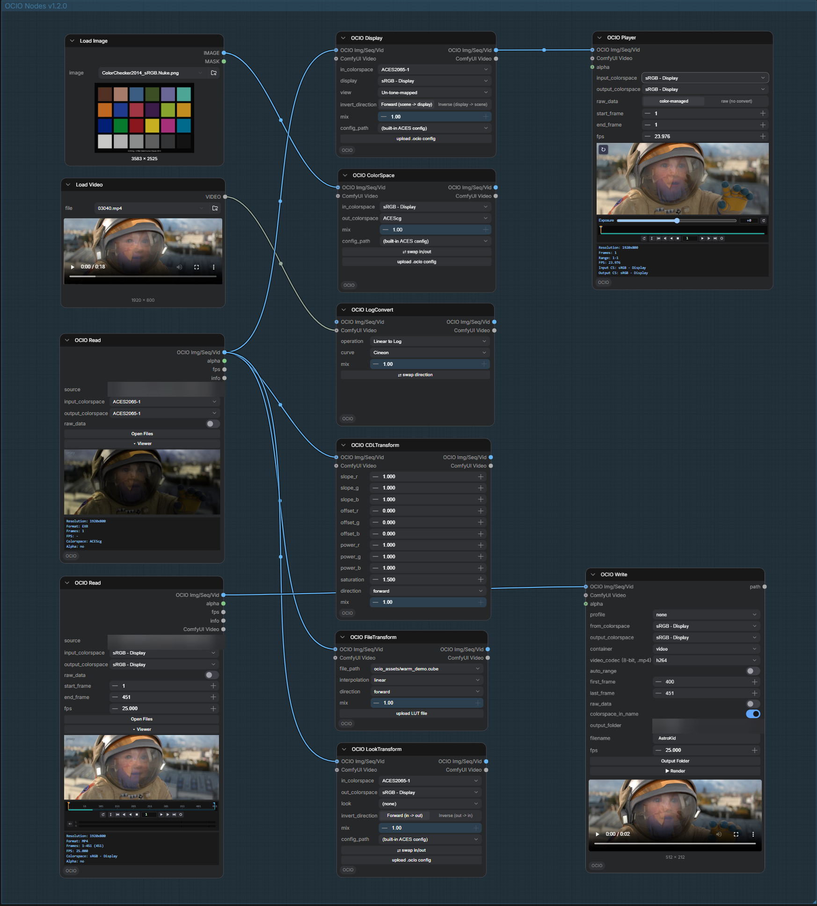
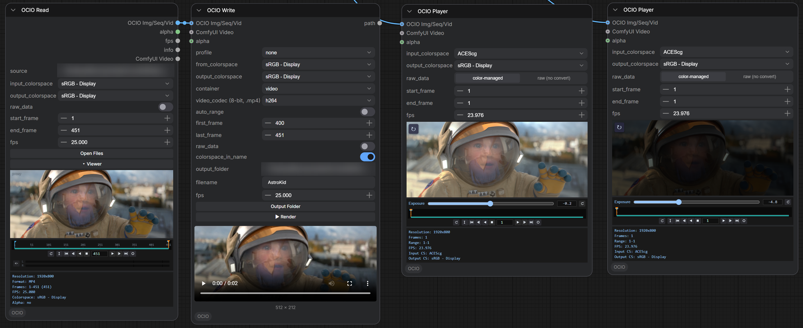
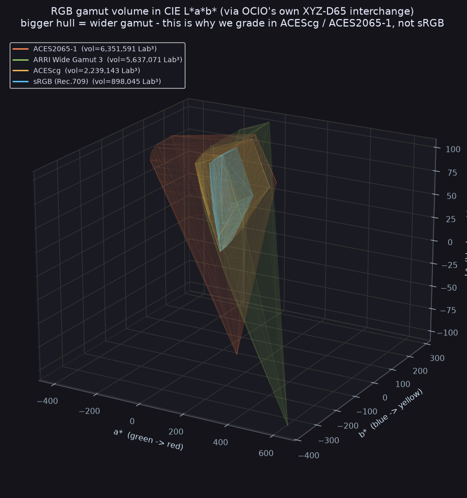
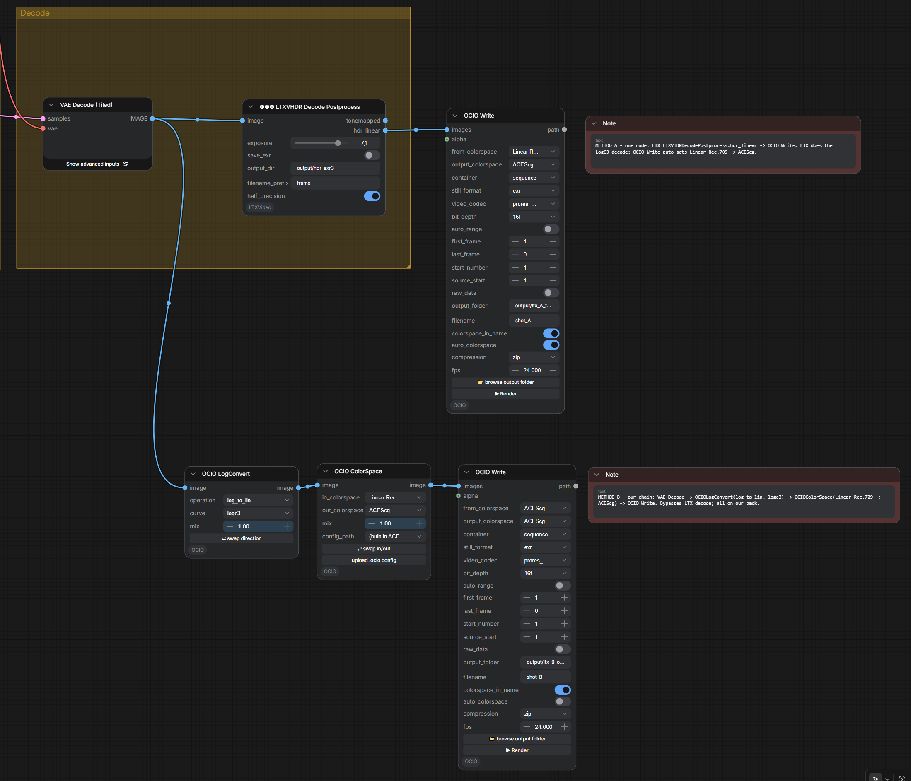

<div align="center">


# ComfyUI-OCIO

**Nuke-style OpenColorIO color nodes for ComfyUI.**
<br>
**Read a sequence, grade in ACES, write ProRes - fully color-managed.**
<br>
**Now on ComfyUI's native VIDEO wire:**
<br>
**Color-Manage HDR, LTX, Flux, Cineon and 10-bit clips inside a native video graph.**

**By [AI VFX NEWS](https://aivfxnews.com/) · Slava Sexton.**


</div>

---

Eleven color-management nodes for ComfyUI, modelled on **The Foundry Nuke's OCIO node set** and backed by
**OpenColorIO** with the built-in **ACES** config. Convert between colorspaces, grade with ASC CDL, apply a
display transform or a LUT, scrub the result in an on-node viewer, and - the two big ones - **Read** any
still / image sequence / video off disk and **Write** it back out color-managed, in EXR / TIFF / PNG / JPEG
or ProRes / DNxHR / h264 / hevc.

Every node is a standard ComfyUI node, so it interoperates with the whole ecosystem on plain `IMAGE` / `MASK` /
`FLOAT` / `STRING` types: pipe **OCIO Read** into any node, and any node into **OCIO Write**. The six color nodes
now also carry a native ComfyUI **VIDEO** input and output beside the IMAGE one, so they drop straight into
ComfyUI's native video graph as color and light stages: `Load Video -> OCIO color node -> Video Combine / Save
Video`. Same nodes, same math, now on the native VIDEO wire.

<div align="center">



</div>

## Install

**Manual (works today):**

```bash
cd ComfyUI/custom_nodes
git clone https://github.com/SlavaSexton/ComfyUI-OCIO
pip install -r ComfyUI-OCIO/requirements.txt
```

Restart ComfyUI. The nodes appear under the **OCIO** category.

**ComfyUI Manager:** the pack is in the Comfy Registry and installs from Manager's node list. In the
**Select Version** dialog pick **Nightly**, which is what Manager offers by default and what tracks this
repository.

The numbered entries there are older on purpose. The registry holds 1.2.3 and 1.2.4, both sitting `Flagged`
after its automated scan read the pack's `ffmpeg` and `ffprobe` calls as a risk, and publishing is paused
while that stands, so newer versions are GitHub releases only. Picking `Latest` or a number in that dialog
therefore installs code from before the fixes in 1.2.5 and 1.2.6. Nightly, or the manual clone above, gets
you the current one.

> **EXR note.** OpenCV reads and writes EXR only when `OPENCV_IO_ENABLE_OPENEXR=1` is set in the environment
> **before** ComfyUI starts. Set it in your launcher (`set OPENCV_IO_ENABLE_OPENEXR=1` on Windows,
> `export OPENCV_IO_ENABLE_OPENEXR=1` on Linux/macOS) if you work with EXR.

## Requirements

- **OpenColorIO** (`pip install opencolorio`) - the color engine. All nodes except **OCIO LogConvert** need it.
- **OpenCV** (`opencv-python-headless`), **tifffile**, **Pillow**, **numpy** - image IO.

`requirements.txt` covers all of the Python packages above (`pip install -r requirements.txt`).

### Video and codecs (ffmpeg)

**Stills and image sequences need nothing extra** - EXR / TIFF / PNG / JPEG go through OpenCV, tifffile and
Pillow, installed by `requirements.txt`.

**Video needs ffmpeg.** ffmpeg *is* the codec engine: ProRes, DNxHR, h264 and hevc all come from it, so OCIO
Read / Write shell out to `ffmpeg` (and `ffprobe`) for any `.mov` / `.mp4`. You install it yourself, once, and
it must be a **full build** (the codecs above are only in full builds) on your system `PATH`:

- **Windows:** [gyan.dev](https://www.gyan.dev/ffmpeg/builds/) *full* build, or `winget install Gyan.FFmpeg`.
- **macOS:** `brew install ffmpeg`.
- **Linux:** `apt install ffmpeg` (or your distro's package).

Check it is found with `ffmpeg -version` in a terminal. If ffmpeg is not on `PATH`, the still/sequence nodes
still work - only the video container in OCIO Read / Write is unavailable, and it says so.

#### What each codec actually writes

Measured, by encoding one and reading the file back with `ffprobe` (`bits_per_raw_sample` and `pix_fmt`), not
copied from a table:

| `video_codec` | container | pixel format | depth | chroma |
| --- | --- | --- | --- | --- |
| `prores_4444` | `.mov` | `yuv444p12le` | 12-bit | 4:4:4 |
| `prores_422hq` | `.mov` | `yuv422p10le` | 10-bit | 4:2:2 |
| `prores_422` | `.mov` | `yuv422p10le` | 10-bit | 4:2:2 |
| `dnxhr_hq` | `.mov` | `yuv422p` | 8-bit | 4:2:2 |
| `dnxhr_hqx` | `.mov` | `yuv422p10le` | 10-bit | 4:2:2 |
| `dnxhr_444` | `.mov` | `yuv444p10le` | 10-bit | 4:4:4 |
| `dnxhr_hq_mxf` | `.mxf` | `yuv422p` | 8-bit | 4:2:2 |
| `dnxhr_hq_mxf_opatom` | `.mxf` | `yuv422p` | 8-bit | 4:2:2 |
| `h264` | `.mp4` | `yuv420p` | 8-bit | 4:2:0 |
| `hevc` | `.mp4` | `yuv420p` | 8-bit | 4:2:0 |

Three things worth knowing before choosing:

- **The DNx encoder here has no 12-bit pixel format at all.** It advertises exactly
  `yuv422p yuv422p10le yuv444p10le gbrp10le`, so `dnxhr_444` buys full chroma rather than more bits. For 12 bit
  the route is ProRes 4444.
- **These figures describe the files this pack writes, and claim nothing about the Avid formats themselves.**
  Avid's own sources disagree with the widely-repeated 8/10/12 table: its historical *High Resolution Workflows
  Guide* calls both HQX and 444 12-bit, while its current naming page (April 2026) says that after the 2025
  revision of ST 2019-1 the DNxHD / DNxHR / DNxGX families are unified as *Avid DNx*, with every level admitting
  8 to 16 bits and extended sampling. The split is a property of particular implementations, this encoder's
  included.
- **The two MXF entries are the same DNxHR HQ picture as `dnxhr_hq`, in a different wrapper.** `dnxhr_hq_mxf` is
  OP1a, one self-contained file with picture and sound; `dnxhr_hq_mxf_opatom` is OPAtom, which holds one essence
  per file by design (SMPTE ST 390), so a wired audio track is written beside it as a `.wav` rather than muxed in.
  Both carry the colour tags and a timecode. Of the shot identity, only the reel name is a documented MXF
  interchange field - ffmpeg writes it as the Physical Source Package Name, which is what Avid means by Tape Name.
  The rest travels as ffmpeg's own AAF-compatible tagged values, read back by ffmpeg itself, and is dependable
  only in the sidecar `.json`.

### Compatibility: web UI and standalone

The pack runs the same in both places: the **ComfyUI web UI** in a modern browser (tested in Google Chrome) and
the **desktop / standalone** ComfyUI app. The nodes are pure Python, and the front end is a small `web/` bundle
that loads in any current browser and in the standalone app alike. There is no OS-specific native code to build.
The only external dependency for VIDEO is **ffmpeg** on your `PATH` (see above); for EXR, set
`OPENCV_IO_ENABLE_OPENEXR=1` before ComfyUI starts. Neither is platform-specific: set them once on Windows, macOS
or Linux and the nodes behave identically.

### Docker test environment

A containerized, CPU-only ComfyUI with this pack installed lets you run and verify the nodes
programmatically - no GPU and no model downloads. It builds native arm64 on an Apple-silicon Mac and
amd64 in CI from one `docker/Dockerfile`:

```bash
docker compose build
docker compose run --rm roundtrip   # round-trips the Kodak "Marcie" image and checks the color math with OpenCV histograms
docker compose run --rm test        # standalone tools/test_*.py + node-registration smoke
docker compose up comfyui           # interactive headless server on http://localhost:8188
```

See **[docs/DOCKER.md](docs/DOCKER.md)** for the full round-trip test design and configuration.

## Colorspaces, the short version

ComfyUI has no color management: it holds images as plain gamma-encoded **sRGB** in `0..1`. These nodes add the
color pipeline on top. The working space is **`sRGB - Display`** (what ComfyUI expects); **OCIO Read** converts
files *into* it and **OCIO Write** converts *out* of it. Defaults follow the file type: **EXR -> ACEScg**
(scene-linear render space), **JPEG / PNG / TIFF -> sRGB - Display**. Colorspace names come from the active OCIO
config (the built-in ACES **studio-config**, ~55 spaces including ARRI / RED / Sony camera spaces); drop a custom
`.ocio` in your input folder to use your own.

The config is **ACES 2.0**, so a few names differ from the ACES 1.x names you may know from Nuke: `Linear Rec.709
(sRGB)` is the old `Utility - Linear - sRGB`, and `ARRI LogC3 (EI800)` is `Input - ARRI - V3 LogC (EI800)`. The
whole camera set is present (ARRI LogC3 / LogC4, RED Log3G10, Sony S-Log3, Canon Log, Panasonic V-Log, Apple Log,
and more), just under the 2.0 names. Colorspace conversions match Nuke's; the display transform (OCIO Display) is
the ACES 2.0 output, which reads slightly different from an ACES 1.x setup.

---

## Image and Video: native ComfyUI video pipeline

These nodes are pure color and light operators, so they belong anywhere in a graph, on stills or on a moving
clip. Each of the six color nodes (ColorSpace, LogConvert, Display, CDLTransform, FileTransform, LookTransform)
carries two inputs side by side: an IMAGE input labelled **"OCIO Img/Seq/Vid"** and a VIDEO input labelled
**"ComfyUI Video"**. They are mutually exclusive: connect one and the other auto-disconnects. Only the socket
that matches the live input carries real data; the other stays empty (`None`) at runtime, so a VIDEO in gives
you a VIDEO out and an IMAGE in gives you an IMAGE out. Wire the input before the output and this is automatic.

The VIDEO type is ComfyUI's **native** video (the `comfy_api` `VideoFromComponents`, the same type **Load Video**
emits), not a custom wrapper. So the nodes talk directly to **Load Video**, **Save Video**, **Video Combine**,
**Get Video Components**, and **VHS**. Drop a color node into the middle of a stock video graph and it fits.

Two ends of the wire matter most:

- **OCIO Read** exposes a VIDEO output ("ComfyUI Video") that feeds ComfyUI-native video nodes downstream.
- **OCIO Write** takes a VIDEO input. Wire **Load Video** (or any VIDEO source) into it and Write **records** that
  native clip to disk with all of its settings: container, codec, output colorspace, bit depth. The container
  inherits the clip's frame rate. Verified: `Load Video -> OCIO Write (video, h264)` writes a valid h264 mp4.

The practical result: color-manage and render HDR, LTX, Flux and Cineon plates, and 10-bit Seedance 4K, straight
inside a native ComfyUI video graph, without bouncing frames out to a folder and back.

---

## The eleven nodes

<div align="center">



</div>

### OCIO Read

Load a **still / image sequence / video** off disk and color-manage it on the way in (Nuke: *Read*).

- **source** - a path to a file, a sequence folder, a frame pattern (`shot.####.exr`), or a video, **anywhere on
  disk**. Type it in, or pick one with **Open Files**; the file is read in place, nothing is copied.
- **Detect from Source** - re-read range, fps and colorspace from the file. Those fields fill in automatically
  when the source changes and are left alone afterwards, so opening a workflow keeps what you set; press this
  when you have edited them and want the file's own numbers back.
- **frame_mode** - `auto` (a numbered file with siblings loads the whole sequence, Nuke's "grab sequence"),
  `single` (just that file), `sequence` (force-collapse the siblings). A folder is always a sequence; a video is
  always its full clip.
- **input_colorspace** - the colorspace the file *is* in. Auto-suggested from the file: EXR / HDR -> ACEScg;
  a PQ or HLG clip -> the matching Rec.2100 space; an SDR **ProRes / DNxHD, or anything in an MXF** ->
  `Rec.1886 Rec.709 - Display`, because a post codec in a professional container is a camera or mastering
  file rather than a web deliverable; everything else -> `sRGB - Display`. It is a guess from the container,
  and yours to overrule - a log-encoded ProRes carries no tag saying so and will be guessed as Rec.709.
- **output_colorspace** - the working space the IMAGE comes out in (default `sRGB - Display`).
- **raw_data** - skip the conversion; pass the file's values through untouched (Nuke's *Raw Data*).
- **start_frame / end_frame** - the frame-number range to load (auto-filled to the detected range). Frames
  requested outside the range are filled by **edge_mode** (`hold` / `loop` / `bounce` / `black`).
- **frame_shift** - re-base the numbering: the number the **first** frame becomes downstream (e.g. a 1001-start
  sequence -> 1). Flows to **OCIO Write**.
- **missing_frames** - how to fill a gap *inside* the sequence (a missing frame): `black`, `hold` the previous
  frame, or `error`. Missing frames are detected automatically and listed on the node and in the `info` output.
- **fps** - taken from the video metadata (24 for stills); flows to **OCIO Write** through the wire.

**Two panels on the node face, each with its own disclosure button.** `▾ Viewer` folds the picture away -
thumbnail and transport. `▾ Metadata` folds the header read-out: plain text, one line per field, and **rows
with nothing to say are not drawn**, so a bare EXR shows a handful of lines and a camera master shows many.
It lists what the file IS (resolution, format, codec, pixel format, frame range, fps, colorspace, primaries
and transfer, alpha) and then which picture it is (reel, scene, shot, take, camera, lens, **timecode**) -
the same read that travels down the `metadata` wire, so what you see is what gets delivered. A UMID parked
in the reel field by some applications is not shown as a reel (it is a machine identifier, not a name), but
it is still written into the output file.

**Outputs:** `OCIO Img/Seq/Vid` (the frame batch), `alpha` (MASK, the file's alpha channel), `fps`, `info`
(frames / resolution / format / range / missing frames), `ComfyUI Video` (a native ComfyUI VIDEO of the same
color-managed batch, to feed Load Video / Save Video / Video Combine and the like), and `metadata` - the
plate's own header, JSON, to wire into **OCIO Write** so the camera, lens, editorial fields and the start
timecode survive into the delivered file.

### OCIO Write

Color-manage an IMAGE batch and **write it to disk** (Nuke: *Write*).

- **from_colorspace** - the working space of the incoming image (default `sRGB - Display`).
- **output_colorspace** - the colorspace to encode into. The format picks the right default (EXR -> ACEScg,
  PNG / TIFF / JPEG -> sRGB). Written into the file metadata where the format allows it.
- **container** - `still image` (one frame), `sequence` (numbered frames), or `video`.
- **still_format** - `exr` / `tiff` / `png` / `jpeg` (used for still / sequence).
- **video_codec** - `prores_4444` / `prores_422hq` / `prores_422` / `dnxhr_hq` / `h264` / `hevc` (used for video).
- **bit_depth** - narrows to the format: JPEG 8; PNG 8 / 16; TIFF 8 / 16 / 32f; EXR 16f / 32f.
- **compression** (EXR only) - defaults to **DWAA**, which is lossy and much smaller, the way most of the
  industry writes anything that is not an archival master. Pick `zip` (or `zips` / `rle` / `piz`) when the
  file has to be bit-exact. Your choice is saved with the workflow; the default only applies to a new node.
- **auto_range** - pull `first_frame` / `last_frame` / `start_number` / `fps` **automatically from the OCIO Read**
  at the other end of the wire (through any number of nodes). Edit them by hand and it turns off; turn it back on
  to re-detect.
- **first_frame / last_frame** - which frames to write. **start_number** - the number on the first output file
  (the re-base, e.g. `0086`).
- **output_folder** - where to write (**Output Folder** picks a folder on disk, or type / create one).
  **filename** - the base name; numbering and extension are added automatically.
- **alpha** (optional) - wire a MASK here to write **RGBA** (EXR / TIFF / PNG). **fps** (optional) - wire OCIO
  Read's `fps` to carry the source rate.
- **video** (optional, mutually exclusive with the image input) - wire a **ComfyUI Video** (Load Video or any
  native VIDEO source) to record it with all of these settings; the container inherits the clip's own frame rate.
- **metadata** (optional, wire only) - wire **OCIO Read**'s `metadata` output here and the plate's own header
  travels into the file you write: camera, lens, reel / scene / shot / take, and the **start timecode**.
- **raw_data** - write the pixels as-is, skipping the conversion.

**There is no timecode field, deliberately.** A code typed into the writer is a code invented at delivery;
the one that matters arrives with the plate. Wire `metadata` and the start comes from the source, with this
node advancing it per written frame - into every EXR header and into a movie's own timecode track. Nothing
wired, no timecode written. What the file already answered for itself (chromaticities, frame rate, frame
counter, timecode) is always re-authored rather than copied, in whatever spelling it arrived under, so one
file can never end up carrying two disagreeing timecodes.

The node **previews the first written frame** in its output colorspace (a wrong colorspace pick looks visibly
wrong) and reports **"wrote N frame(s)"**. The **▶ Render** button queues the graph.

Naming: still image -> `<name>.<ext>`; sequence -> `<name>.0086.<ext>, <name>.0087.<ext>, ...`; video ->
`<name>.mov` (ProRes / DNxHR) or `<name>.mp4` (h264 / hevc).

**HDR source profiles (`profile`).** The top dropdown presets the whole node for a known HDR source.
`LTX 2.3 HDR` sets `Linear Rec.709 (sRGB) -> ACEScg`. `LumiPic LogC3 (Flux/Qwen)` and `LumiPic V10 LogC4` also
decode the log curve inside Write, so you wire a LumiPic VAE-decode plate straight in and it lands in ACEScg. Any
HDR profile forces an EXR 16f master. `auto` reads the upstream node: it detects LTX reliably, and for LumiPic it
guesses from the LoRA filename, so confirm that pick. `none` leaves the colorspaces as you set them, and editing a
colorspace by hand switches `profile` back to `none`. `Seedance 4K 10-bit` is a placeholder pending its color spec.

**Codec drives the video output.** The `video_codec` fixes the bit depth and the container, and the node states the
depth on itself once you pick one. The measured table for all ten is under
[What each codec actually writes](#what-each-codec-actually-writes); it lives in one place on purpose, because a
second list in this section is a second thing to forget to update. The file carries the right NCLC color tags
(primaries / transfer / matrix) from `output_colorspace`, so it does not gamma-shift between players. Video
defaults to `sRGB - Display` to match the ComfyUI preview; switch it to `Rec.1886 Rec.709 - Display` for a
broadcast 2.4 master, or `Rec.2100-PQ` for HDR video.

**Audio.** Wire an `AUDIO` output into the `audio` input and a `video` container muxes it in, 24-bit PCM in a
`.mov` or an MXF OP1a and AAC in an `.mp4`, trimmed to exactly the frames written so it cannot drift. A `sequence`
gets a `.wav` beside the frames instead, because EXR, TIFF and PNG hold no audio, and so does MXF OPAtom, which
holds one essence per file by design. A native ComfyUI `Video` input brings its own track automatically; the
`write_audio` toggle is how you decline that, since there is no wire to disconnect. For lip sync on LTX-2.5, read
the offset caveat in the [LTX-2.5 recipe](#recipe-ltx-25-hdr-which-is-a-different-mechanism-from-23) first.

> **If the folder is empty and the run said success, this is usually why.** ComfyUI's front end can send a
> `partial_execution_targets` list with a prompt, naming which output nodes to run. Every output node *not* in that
> list is dropped before execution starts, with no error, no warning and a `success` status. `OCIO Write` is an
> output node, so it is droppable that way. Reproduced here, three runs of one graph with a single variable: no
> field at all wrote both outputs; the field present and naming only a preview node wrote **nothing** while
> reporting success; the field naming the write wrote both again. So the field is not the problem, the list
> contents are.
>
> **The node cannot warn you about this, and that is not an oversight.** A skipped node never executes, so it has
> nothing to report its own absence with: `validate_prompt` filters the output set, `ExecutionList` is seeded only
> from what survives that filter, and nothing downstream calls the node at all. If a render reports success over an
> empty folder, queue it from the graph rather than through a partial run, or post the prompt to `/prompt` yourself
> without that field.

### OCIO Player

An on-node **float viewport** for scrubbing a graded result, input-only (like Preview Image - nothing flows
out, so wiring it never breaks the graph downstream). Takes an **OCIO Img/Seq/Vid** batch or a **ComfyUI Video**
(mutually exclusive, same as the color nodes). **input_colorspace -> output_colorspace** bakes the display
transform live on the GPU; **raw_data** shows the pixels untouched. **start_frame / end_frame** and **fps** set
the playback range, with a transport bar (play / step / loop) and an **exposure** slider (view-only, never
baked into the graph).

**What you are looking at, plainly, because it decides whether you can trust it.** The picture on screen is
8-bit SDR. The data behind it is not: the frame is half float and keeps everything the render produced, values
above white included, and the exposure control multiplies those real values on the GPU before anything is drawn.
Only the final composite is 8-bit. So you cannot see the whole range at once, but you CAN find out whether a
highlight is there: pull exposure down, and if detail appears the data was always there. The exposure window
reaches linear 222.86, which is 7.8 stops over diffuse white, and stops separating values past that.

**On a calibrated HDR monitor this viewport still presents SDR, and that is a property of the viewport rather
than of the browser.** A WebGL2 drawing buffer can hold 16-bit float, through `drawingBufferStorage` (Chrome 122
onward), and this one uses the default 8-bit buffer. Measured with both preconditions that call requires: the
buffer reports 16 bits per channel and reads back 4.0 and -0.25 unchanged. So judge RANGE and colour decisions
here, and judge how the picture LOOKS on your grading monitor. [docs/NODES_COLOR.md](docs/NODES_COLOR.md) carries
the call, its preconditions, and the limits of what that measurement establishes.

### OCIO ColorSpace

Convert between two OCIO colorspaces (Nuke: *OCIOColorSpace*). **in_colorspace -> out_colorspace**, a **mix**
blend with the original, and an optional **config_path**. The **swap** button flips in / out in one press.
Also takes a **ComfyUI Video** input, mutually exclusive with the image (see *Image and Video* above).

### OCIO LogConvert

Linear <-> log (Nuke: *OCIOLogConvert*), **dependency-free** (no OCIO needed). **operation** (`Linear to Log` /
`Log to Linear`), **curve**, **mix**. Curves are the published specs, verified by round-trip:

- **Cineon** - Nuke's flat film log; black `0` lifts to `0.0928` (matches Nuke's default). *(default)*
- **ACEScct** - ACES log with a toe (black `0.0729`, S-2016-001).
- **ACEScc** - pure ACES log (S-2014-003).
- **ARRI LogC3** - ARRI LogC3 EI800; ceiling ~55 linear. The curve LTX-2's HDR IC-LoRA uses.
- **ARRI LogC4** - ARRI LogC4; wider headroom, ceiling ~469.8 linear. The curve LumiPic's V10 `*_logc4_*` HDR LoRA targets.
- **Sony S-Log3**, **Panasonic V-Log**, **Canon Log 3**, **RED Log3G10**, **DaVinci Intermediate** - the rest of the camera-native set.

The **swap** button flips the direction. For **ARRI LogC3 / LogC4**, `Log to Linear` decodes the plate to linear; keep
the Rec.709 primaries, then convert Rec.709 -> ACEScg with **OCIO ColorSpace** (do not use a config "ARRI LogC3 /
LogC4" colorspace - that assumes ARRI Wide Gamut and would shift the gamut). Also takes a **ComfyUI Video** input,
mutually exclusive with the image (see *Image and Video* above).

### OCIO Display

Apply a **display + view** transform (Nuke: *OCIODisplay*). **in_colorspace**, **display** and **view**
(pickers from the active config), **invert_direction**, **mix**. This is the scene-referred -> display-referred
step (e.g. ACEScg -> the ACES SDR view on an sRGB monitor). Also takes a **ComfyUI Video** input, mutually
exclusive with the image (see *Image and Video* above).

### OCIO CDLTransform

An **ASC CDL** grade (Nuke: *OCIOCDLTransform*): **slope**, **offset**, **power** per channel (R / G / B) plus
**saturation**, a **direction** (forward / inverse), and **mix**. The industry-standard primary grade. Also
takes a **ComfyUI Video** input, mutually exclusive with the image (see *Image and Video* above).

### OCIO FileTransform

Apply a **LUT / CCC / CDL file** (Nuke: *OCIOFileTransform*). **file_path** is a picker of LUTs in your input
folder (`.cube`, `.3dl`, `.spi1d`, `.spi3d`, `.csp`, `.ccc`, `.cdl`, `.clf`, ...); the **upload** button adds one
from your machine. **interpolation** (linear / nearest / tetrahedral / best), **direction**, **mix**. Also takes
a **ComfyUI Video** input, mutually exclusive with the image (see *Image and Video* above).

### OCIO LookTransform

Apply an **OCIO look** (Nuke: *OCIOLookTransform*). **in_colorspace -> out_colorspace** through a named **look**
from the config (e.g. *ACES 1.3 Reference Gamut Compression*), **invert_direction**, **mix**. The **swap** button
flips in / out. Also takes a **ComfyUI Video** input, mutually exclusive with the image (see *Image and Video*
above).

### OCIO VAE Decode

Decode a latent **without the 0..1 clamp**. The stock `VAEDecode` finishes with `.clamp_(0, 1)`, which is correct
for an 8-bit preview and destructive for anything else: on an HDR decode the values above white and below black
are simply gone, and no float container recovers them afterwards because the range never reached the tensor. This
node keeps them.

- **clamp** - off by default. On, it reproduces the stock node exactly, for comparison.
- **precision** - `float32` (the default) or `float16`. The precision is always named: a colour pipeline should
  state the dtype it ran at rather than inherit whichever one the checkpoint's branch of `comfy/sd.py` happens to
  list first. **float32 is the expensive default**, measured on 25 frames at 1280x704 tiled at 384: about **5x**
  the model's own dtype on the decode (5.96 s against 29.90 s, timed per node from the server's websocket) and
  **1.80x** on the encode. Untiled at full resolution it is far worse - it spills into VRAM offload - so turn
  tiling on when you pick it.
  `float16` is honoured only where the VAE lists it, and the profiles genuinely differ: of the 23
  `working_dtypes` lists in `comfy/sd.py`, 8 omit float16 (the LTX video VAE among them) while 9 put it FIRST,
  and `vae_dtype()` walks that list in order. On the LTX VAE, where it is not listed, the node **declines** and
  says so on the range report instead of forcing the cast - and the decode then runs at the model's own dtype,
  which is how you get the fast path. On the one SDR clip measured here float16 landed closer to float32 than
  bfloat16 did (median 0.000053 against 0.000445) at bfloat16's speed, but its known failure is exponent range,
  which that clip cannot reach, so check an HDR master before delivering one at float16.
  **`model default` was removed**: a saved graph storing it is rejected with `value_not_in_list` and the widget
  has to be re-picked. Widget order did not change, so nothing else in a saved graph shifts.
  `docs/NODES_VAE.md` section 3.2 has the census, the measurements and the caveat - the tooltips are kept short
  on purpose and point there.
- **tiled / tile_size / overlap** - spatial tiling, off by default so no existing graph changes behaviour. Turn it
  on for a long clip, and **leave the temporal defaults alone**: a diffusion decoder has no context at a temporal
  tile edge, so tiling time puts a visibly soft frame at a fixed period. The period is
  `(tile_t - overlap_t)` times the VAE's temporal ratio, which on the LTX-2 VAE at `temporal_size` 32 is every 16
  pixel frames at this node's overlap default, or every 24 at ComfyUI's. The published measurement was taken at the
  24 spacing: per-frame sharpness dipped to 62 % of the clip median at frames 25 / 49 / 73 / 97.
  **Spatial tiling shows no seam, and that is not the same as showing no difference.** Measured on one 25-frame
  latent decoded both ways, tiled against untiled differs by up to 0.147 on the first frame and 0.317 by the
  twenty-fifth, with 58 to 62 % of samples differing at all. That is roughly thirty times the difference the
  `precision` choice makes. The worst pixels are scattered rather than sitting on tile boundaries, so it is the
  decoder doing genuinely different work per tile, not a blend artefact. The growth across the clip is measured and
  unexplained; content brightness does not account for it. Choose tiling once per delivery, not mid-shot.
- **range report** - a second `STRING` output with min / max / mean, percentiles and the exact share of samples
  below 0 and above 1, so you can read what a clamp would have cost before you write the file.

It recognises the VAE's own output transform rather than assuming one. `comfy/sd.py` sets `process_output` to the
identity in eleven places - five image decoders that already emit 0..1, including TAEHV, plus six audio VAEs - and
a node that rewrites that unconditionally turns a correct frame into a washed-out one with no error anywhere. This
one probes the transform, replaces only the shape it knows, and reports anything unfamiliar instead of overwriting.

### OCIO VAE Encode

The other half of the round trip, for consistency with the rest of the pack rather than because the stock encode
is broken. It reports **out-of-range input** instead of letting it fold in silently: the stock path applies
`image * 2 - 1` with no clamp, so values outside 0..1 are carried into the latent without a word. Useful when you
are feeding it a real HDR plate and want to know what the model was actually given.

---

## Color accuracy, measured

Accuracy is a number here, not a claim. The pack ships a color-accuracy regression suite (`tools/accuracy`) that
checks every transform against an **independent** PyOpenColorIO reference and the published specs, so you can read
the error instead of trusting the label.

<div align="center">



</div>

That gamut chart is why this pack exists: sRGB (the small hull) is what ComfyUI natively works in; ACEScg,
ACES2065-1 and camera-native gamuts like ARRI Wide Gamut 3 cover far more of what a real plate or an HDR
generation actually contains. Grading in sRGB throws that range away before you even start.

Latest run:

- **Bit-exact OCIO parity, per transform.** OCIOColorSpace, Display and CDL match the raw OCIO CPU processor bit
  for bit: worst max-abs error **0.000e+00** across 9 transforms x 4 fixtures, 0 results over the 1e-4 threshold.
  This is the accuracy number: our node output does not alter what OCIO computes.
- **End-to-end round-trip, verified through a real headless ComfyUI.** In the containerized test harness
  (`docker/`, run in CI), a full `ACEScg -> ARRI LogC -> linear Rec.709 -> back` round-trip returns to the source
  at **max abs error 4.5e-6, mean 3.1e-8**. The residual is OCIO's single-precision LUT interpolation, the same
  in Nuke / Resolve / any OCIO tool. It is **not** bit-for-bit lossless (nothing through an OCIO LUT is), but the
  error (~2^-17.8) is about 100x finer than one half-float (EXR 16f) step near 1.0 (~2^-11), so a half-float
  delivery never resolves it. In bit terms: light is non-negative, so half-float's sign bit is unused and its
  usable range is ~15 bits, and the round-trip holds ~14.6 of them, a sub-half-bit shortfall against the container.
- **HDR safety: 0 silent clamps.** Negatives and values above 1.0 survive the conversions, curves and grades. No
  quiet clip to the `0..1` box.
- **Rec.709 -> ACEScg parity: 0.00e+00.** The exact path the LTX and Flux HDR recipes rely on.

The suite renders its evidence to `docs/assets/accuracy/`: `gamut_volume_3d.png` (the RGB gamut hulls above, all
via OCIO's own colorspace conversions, no hand-rolled matrices), `ocio_parity.png` (node output vs the raw OCIO
CPU processor, per transform), `log_curves.png` (log round-trips and vendor-spec anchors), `hdr_safety.png`
(negatives and >1 values across conversions, curves and grade), `roundtrip.png` (A->B->A plus real EXR/PNG
write/read loops), `deltaE_colorchecker.png` (ΔE2000 on the 24 X-Rite patches), `quantisation_dither.png`
(8/16-bit and EXR write/read-back banding), and `histogram_compare.png` (a per-channel distribution match vs the
reference - a shape sanity-check, not the accuracy number; the max-abs errors above are the accuracy number).
See `tools/accuracy/README.md` to run it yourself, or `docs/DOCKER.md` for the end-to-end round-trip in a
container.

---

## Recipe: LTX-2.3 SDR-to-HDR, written as an ACEScg EXR sequence

**OCIO Write takes the LTX-2.3 HDR IC-LoRA output and writes it as an ACEScg EXR sequence.** LTX's HDR IC-LoRA
encodes the HDR range with the ARRI LogC3 curve on **Rec.709 primaries**. There are two ways to wire it to this pack.

<div align="center">



</div>

**Method A, one node (use LTX's own decoder).** LTX's `LTXVHDRDecodePostprocess` node undoes the LogC3 curve and
gives a linear-HDR `IMAGE` on its `hdr_linear` output, a plain ComfyUI `IMAGE` that pipes straight into **OCIO Write**:

```
... VAE Decode -> LTXVHDRDecodePostprocess -> (hdr_linear) -> OCIO Write
```

Wire it and OCIO Write auto-detects the LTX node upstream and sets `from_colorspace = Linear Rec.709 (sRGB)` and
`output_colorspace = ACEScg` for you (`auto_colorspace`, on by default).

**Method B, our chain (skip LTX's decoder).** Do the whole decode on this pack: tap LTX's `VAE Decode` output (the
raw LogC3 plate), run **OCIO LogConvert** (`Log to Linear`, curve `ARRI LogC3`) to get linear Rec.709, then **OCIO ColorSpace**
(`Linear Rec.709 (sRGB)` -> `ACEScg`), then **OCIO Write**:

```
... VAE Decode -> OCIO LogConvert (logc3) -> OCIO ColorSpace (Rec.709 -> ACEScg) -> OCIO Write
```

Use OCIO LogConvert's **`logc3`** curve, NOT the config's "ARRI LogC3" colorspace: that one assumes ARRI Wide Gamut
primaries and would shift the gamut, but LTX keeps Rec.709.

On either OCIO Write set `container = sequence`, `still_format = exr`, `bit_depth = 16f` (the 16-bit half float LTX
targets). With `colorspace_in_name` on (default) the files come out `name_acescg.0001.exr, name_acescg.0002.exr, ...`.

Verified on a live ComfyUI: the real `LTXVHDRDecodePostprocess` `hdr_linear` -> OCIO Write path writes a two-frame
ACEScg EXR sequence with HDR values (well above 1.0) preserved; the `logc3` curve round-trips and matches LTX's own
decode to float precision. As with any EXR here, set `OPENCV_IO_ENABLE_OPENEXR=1` before ComfyUI starts.

---

## Recipe: LTX-2.5 HDR, which is a different mechanism from 2.3

**These two are not interchangeable, and the wrong preset does not error - it just looks wrong.** LTX-2.3's HDR is
an IC-LoRA trained on the ARRI LogC3 curve, and Lightricks' own ComfyUI node already undoes that curve, so what
reaches this pack is **linear**. LTX-2.5's HDR is **ACEScct**, reached through the `--hdr` flag in their reference
CLI: their pipeline rotates the source primaries to AP1 *before* compressing, so the VAE hands out ACEScct **log
codes already in ACEScg primaries** and only the transfer has to be undone. Feed 2.5 material through the 2.3
preset and log gets treated as linear: the frame comes out flat and grey.

<div align="center">


</div>

**Two ways to undo the curve, and they are equivalent.** The diagram shows the explicit one, which is the clearer
starting point: **OCIO LogConvert** with `operation = Log to Linear` and `curve = ACEScct` after the decode, and
the mirror of it (`Linear to Log`, `ACEScct`) before the encode. The short one is **OCIO Write**'s
`profile = LTX 2.5 HDR (ACEScct)`, which asks the OCIO config for ACEScct to ACEScg and forces EXR 16f, matching
the half-float EXR their reference writes. Pick whichever you can read at a glance in your graph.

**Decode with the clamp off, or the range you came for is gone.** That is what **OCIO VAE Decode** is for: the
stock `VAEDecode` finishes with `.clamp_(0, 1)`. Turn `tiled` on for anything long, and read the node's
**range report** output to see what a clamp would have cost before you write.

**The audio track bypasses colour, and it arrives late.** LTX-2.5 has a separate audio VAE, and its output is
**offset against the source wav**: measured envelope correlation peaks at **+0.661 at -64 ms**, inside the -60 to
-125 ms range others have reported, against +0.002 when the model composes its own track instead. Our muxing adds
no drift of its own (measured 0.00 ms), but that measures the mux, not the VAE. So for anything that has to lip
sync, **line the original wav up against the picture in the edit** rather than trusting the decoded track, which
the lossy audio VAE degrades anyway. Wire the track into **OCIO Write**'s `audio` input for a review movie, and
turn `write_audio` off for a picture-only master.

---

## API video sources (Seedance and friends)

Cloud video nodes (Seedance, Kling, Veo, and the like) emit a `VIDEO`, not an `IMAGE`. To color-manage one,
let the API node save its clip (`SaveVideo`), then load that file with **OCIO Read** (it reads video) and pipe it
into **OCIO Write**:

```
ByteDance2TextToVideoNode -> SaveVideo -> OCIO Read (the saved .mp4) -> OCIO Write
```

Seedance 4K is 10-bit and HDR-ready, but its exact color encoding (Rec.709 vs Rec.2020 / PQ) is not published, so
set OCIO Read's `input_colorspace` to match your actual clip (check the file's tags with `ffprobe`). The
`Seedance 4K 10-bit` profile on OCIO Write is a placeholder until that encoding is confirmed from a real sample.
Verified that a 10-bit clip (both a Rec.709 and a Rec.2020 / PQ variant) loads through OCIO Read and writes back
through OCIO Write with the frame count intact.

## Example workflow

`example_workflows/OCIO_Nodes.json` shows all eight nodes on one image. To open it:

1. Copy `example_workflows/nyc_skyline.png` and `example_workflows/warm_demo.cube` into your **ComfyUI/input**
   folder.
2. Load `OCIO_Nodes.json` in ComfyUI and press **Queue**.

You get the source image run through each of the six color nodes (with a preview each), plus an OCIO Read ->
OCIO Write pair.

## Why this exists (and what's next)

ComfyUI has no real color management. Every model works in plain sRGB, `0..255`, and that is not a gap in one
node, it is the whole ecosystem's default and its ceiling. Diffusion assumes 8-bit sRGB going in and coming out.
That is fine for a thumbnail. It is not fine for anyone who has to hand a plate to a color pipeline.

So this pack builds a real color pipeline on top of a system that was never meant to hold one. A large part of
the work went into making color management function *inside* ComfyUI's IMAGE-only, sRGB world at all. ComfyUI
fought it at nearly every step, from how images are typed on the wire to how the graph reloads. Most of what you
don't see in these nodes is the plumbing that keeps real color math alive in a place that assumes it doesn't exist.

Doing that pushed me toward something much bigger. I'm not going to say what it is yet. What I will say: it aims to
turn ComfyUI into a genuine tool for the people who grade, composite and finish for a living, not a toy that
outputs sRGB JPEGs. More on that soon.

The jokes are over. This is built for working VFX, color and compositing pros from the film and advertising
industry, to their standard. Work continues: bug fixes and new pro-grade features for OCIO color, on an ongoing
basis.

## Credits

Modelled on **The Foundry Nuke's** OCIO node set, powered by the **Academy Software Foundation's OpenColorIO**
and the **ACES** reference config. Full credits and licenses in **[ATTRIBUTION.md](ATTRIBUTION.md)**.

Apache-2.0 licensed. Keep the [`NOTICE`](NOTICE) file with any redistribution. By
**[AI VFX NEWS](https://aivfxnews.com/)**, authored by **Slava Sexton**.
