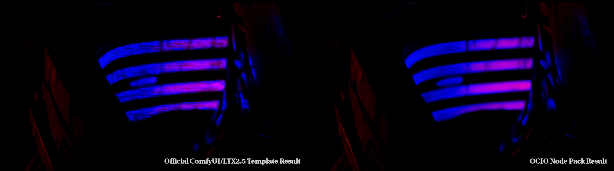
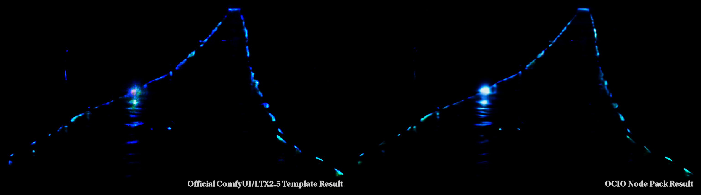
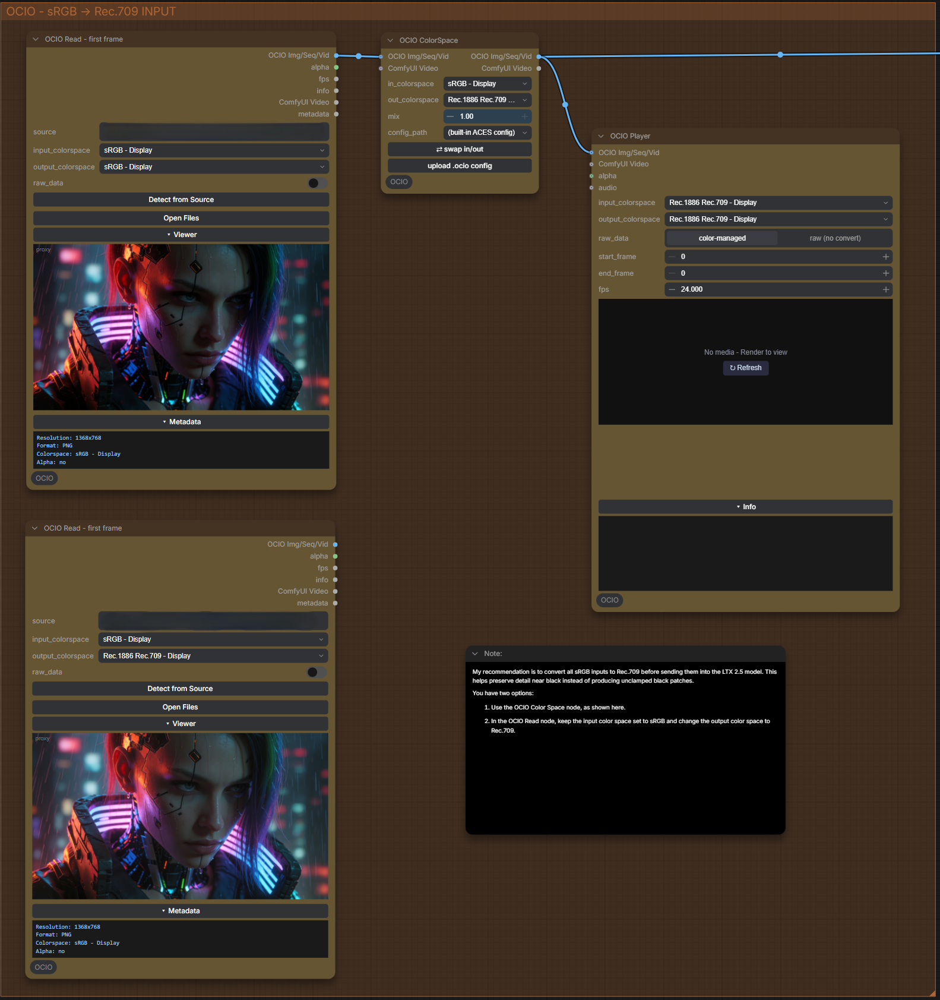
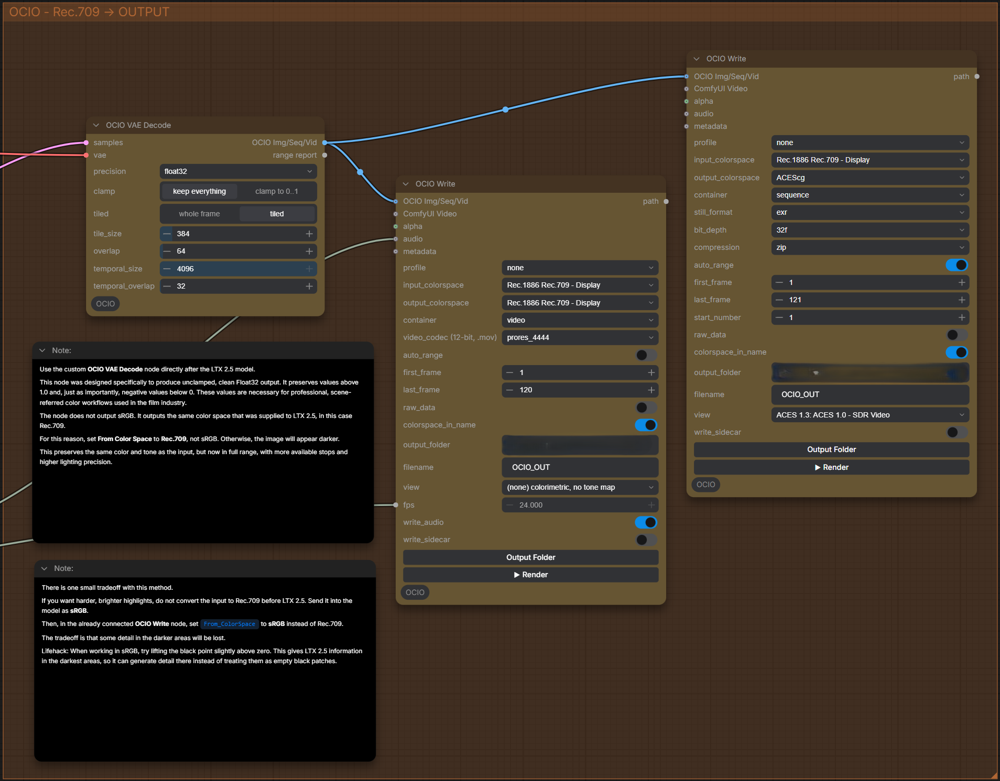

<div align="center">


# ComfyUI-OCIO

**Nuke-style OpenColorIO color nodes for ComfyUI.**
<br>
**Read a sequence, grade in ACES, write ProRes - fully color-managed.**
<br>
**Now on ComfyUI's native VIDEO wire:**
<br>
**Color-Manage HDR, LTX, Flux, Cineon and 10-bit clips inside a native video graph.**

**By [AI VFX NEWS](https://aivfxnews.com/) · Slava Sexton.**

---

### float32 from the model to the master. Nothing is clamped on the way.

`OCIO VAE Decode` runs the decode at **float32 with nothing clamped**, and that one choice is what the rest of
this pack is built on.

**There is no ceiling to hit.** How many stops a render carries is a property of that render, not of this
pack: nothing here caps it, and float32 holds whatever came out of the decode. One frame of one LTX-2.5 master
written through these nodes, opened and counted: peak **131.75**, which is 7 stops over diffuse white, and
**14.25 stops** between the 0.1 and 99.9 percentiles. The next render will read differently. That is the
point - the number comes from the material, and nothing on the way out decides it for you.

**Values below 0 survive too, and that matters more than it sounds.** A negative is not noise to clean up - it
is what a colour outside the working gamut looks like from inside it. Clamp the black and that colour is gone,
along with the headroom a grade needs. Nothing here clamps it.

**Nothing is ever forced through 8 bits.** The master goes out as 32-bit float EXR, or ProRes 4444 at 10-bit
4:4:4, or DPX in log, or a Rec.2100 PQ / HLG deliverable. Scene-linear, log, display-referred: the colorspace is
declared, converted through OpenColorIO, and written as it is.

One LTX-2.5 generation, one latent, one frame, written three ways and counted:

| | distinct brightness levels | picture a viewer could tell apart from the float master |
| --- | --- | --- |
| the float master the model produced | 2304 | reference |
| this pack, ProRes 4444 4:4:4 | 3520 | 0.0001% |
| stock workflow at 10-bit | 882 | 0.0596% |
| stock workflow as it ships | **220** | **5.8098%** |

The number to sit with is the last row against the first: **the model made 2304 levels and the delivered file
kept 220.** Three things separate those two rows, and bit depth is only one of them - the stock path also
subsamples to 4:2:0 and compresses with H.264, where this one stays 4:4:4. That this pack counts above the
master is a quantisation artefact of measuring a wider range, not extra picture; the point of the row is that
nothing was discarded on the way.

---


</div>

---

Eleven color-management nodes for ComfyUI, modelled on **The Foundry Nuke's OCIO node set** and backed by
**OpenColorIO** with the built-in **ACES** config. Convert between colorspaces, grade with ASC CDL, apply a
display transform or a LUT, scrub the result in an on-node viewer, and - the two big ones - **Read** any
still / image sequence / video off disk and **Write** it back out color-managed, in EXR / DPX / TIFF / PNG / JPEG
or ProRes / DNxHR / FFV1 / h264 / hevc, in MOV, MXF, MP4 or Matroska.

Every node is a standard ComfyUI node, so it interoperates with the whole ecosystem on plain `IMAGE` / `MASK` /
`FLOAT` / `STRING` types: pipe **OCIO Read** into any node, and any node into **OCIO Write**. The six color nodes
now also carry a native ComfyUI **VIDEO** input and output beside the IMAGE one, so they drop straight into
ComfyUI's native video graph as color and light stages: `Load Video -> OCIO color node -> Video Combine / Save
Video`. Same nodes, same math, now on the native VIDEO wire.

<div align="center">


</div>

## Install

**Manual (works today):**

```bash
cd ComfyUI/custom_nodes
git clone https://github.com/SlavaSexton/ComfyUI-OCIO
pip install -r ComfyUI-OCIO/requirements.txt
```

Restart ComfyUI. The nodes appear under the **OCIO** category.

**ComfyUI Manager:** the pack is in the Comfy Registry and installs from Manager's node list. In the
**Select Version** dialog pick **Nightly**, which is what Manager offers by default and what tracks this
repository.

The numbered entries there are older on purpose. The registry holds 1.2.3 and 1.2.4, both sitting `Flagged`
after its automated scan read the pack's `ffmpeg` and `ffprobe` calls as a risk, and publishing is paused
while that stands, so newer versions are GitHub releases only. Picking `Latest` or a number in that dialog
therefore installs code from before the fixes in 1.2.5 and 1.2.6. Nightly, or the manual clone above, gets
you the current one.

> **EXR note.** OpenCV reads and writes EXR only when `OPENCV_IO_ENABLE_OPENEXR=1` is set in the environment
> **before** ComfyUI starts. Set it in your launcher (`set OPENCV_IO_ENABLE_OPENEXR=1` on Windows,
> `export OPENCV_IO_ENABLE_OPENEXR=1` on Linux/macOS) if you work with EXR.

## Requirements

- **OpenColorIO** (`pip install opencolorio`) - the color engine. All nodes except **OCIO LogConvert** need it.
- **OpenCV** (`opencv-python-headless`), **tifffile**, **Pillow**, **numpy** - image IO.

`requirements.txt` covers all of the Python packages above (`pip install -r requirements.txt`).

### Video and codecs (ffmpeg)

**Stills and image sequences need nothing extra** - EXR / TIFF / PNG / JPEG go through OpenCV, tifffile and
Pillow, installed by `requirements.txt`.

**Video needs ffmpeg.** ffmpeg *is* the codec engine: ProRes, DNxHR, h264 and hevc all come from it, so OCIO
Read / Write shell out to `ffmpeg` (and `ffprobe`) for any `.mov` / `.mp4`. You install it yourself, once, and
it must be a **full build** (the codecs above are only in full builds) on your system `PATH`:

- **Windows:** [gyan.dev](https://www.gyan.dev/ffmpeg/builds/) *full* build, or `winget install Gyan.FFmpeg`.
- **macOS:** `brew install ffmpeg`.
- **Linux:** `apt install ffmpeg` (or your distro's package).

Check it is found with `ffmpeg -version` in a terminal. If ffmpeg is not on `PATH`, the still/sequence nodes
still work - only the video container in OCIO Read / Write is unavailable, and it says so.

#### What each codec actually writes

Measured, by encoding one and reading the file back with `ffprobe` (`bits_per_raw_sample` and `pix_fmt`), not
copied from a table:

| `video_codec` | container | pixel format | depth | chroma |
| --- | --- | --- | --- | --- |
| `ffv1` | `.mkv` | `gbrp16le` | **16-bit, bit-exact** | RGB 4:4:4 |
| `hevc_444_12` | `.mp4` | `yuv444p12le` | **12-bit** | 4:4:4 |
| `prores_4444` | `.mov` | `yuv444p10le` | 10-bit (reads back as 12, see below) | 4:4:4 |
| `prores_4444xq` | `.mov` | `yuv444p10le` | 10-bit (reads back as 12) | 4:4:4 |
| `prores_422hq` | `.mov` | `yuv422p10le` | 10-bit | 4:2:2 |
| `prores_422` | `.mov` | `yuv422p10le` | 10-bit | 4:2:2 |
| `dnxhr_hqx` | `.mov` | `yuv422p10le` | 10-bit | 4:2:2 |
| `dnxhr_444` | `.mov` | `yuv444p10le` | 10-bit | 4:4:4 |
| `dnxhr_hq` | `.mov` | `yuv422p` | 8-bit | 4:2:2 |
| `prores_4444_mxf`, `prores_4444xq_mxf` | `.mxf` | `yuv444p10le` | 10-bit | 4:4:4 |
| `dnxhr_hqx_mxf` | `.mxf` | `yuv422p10le` | 10-bit | 4:2:2 |
| `dnxhr_444_mxf` | `.mxf` | `yuv444p10le` | 10-bit | 4:4:4 |
| `dnxhr_hq_mxf`, `dnxhr_hq_mxf_opatom` | `.mxf` | `yuv422p` | 8-bit | 4:2:2 |
| `h264` | `.mp4` | `yuv420p`, `yuv420p10le` on HDR | 8-bit, 10-bit on HDR | 4:2:0 |
| `hevc` | `.mp4` | `yuv420p`, `yuv420p10le` on HDR | 8-bit, 10-bit on HDR | 4:2:0 |

Things worth knowing before choosing:

- **`ffv1` is the only one that loses nothing.** This pack hands ffmpeg 16-bit RGB, and FFV1 hands it back
  unchanged: md5 of the decoded stream equals md5 of what went in. Every other entry differs, including a
  `lossless=1` x265, because a 12-bit pixel format has already dropped four bits before the lossless part
  starts. It is described by RFC 9043, and FFV1 in Matroska has been a Library of Congress Preferred Format
  for preservation since December 2023. The cost is size: 700939 bytes against 113879 for ProRes 4444 on the
  same clip of random noise.

<div align="center">


</div>

  The figure above is the write path measured the same way, on one LTX-2.5 generation: **3520 distinct
  brightness levels** through our nodes against **220** through the stock workflow as it ships and **882** with
  its bit depth turned up. The last panel is the part that matters to an eye rather than a histogram, the share
  of the picture that changed visibly above one just-noticeable difference: **0.0001% against 5.81%**. Three
  things differ between those paths and only one of them is bit depth: chroma sampling (4:2:0 against 4:4:4)
  and compression (lossy H.264 against ProRes) carry the rest, which is why the blockiness in panel 4 survives
  at 10-bit.
- **ProRes reads back as 12-bit and carries 10.** All three ProRes encoders in ffmpeg advertise exactly
  `yuv422p10le yuv444p10le yuva444p10le`; there is no 12-bit format for any of them. Asking for one prints
  `Incompatible pixel format 'yuv444p12le' for codec 'prores_ks', auto-selecting format 'yuv444p10le'` and
  encodes 10-bit. `ffprobe` still reports 12 because ProRes 4444 is nominally a 12-bit format, so the label
  comes from the specification and not from the samples. For real 12-bit use `hevc_444_12`.
- **An HDR output space moves h264 and hevc to 10-bit, and refuses the 8-bit DNxHR profiles.** ITU-R BT.2100
  defines HLG and PQ at 10 or 12 bits per sample and at nothing below, so an 8-bit file carrying `bt2020` and
  `arib-std-b67` tags states a standard it cannot hold. `dnxhr_hq` and its two MXF wrappers are 8-bit by
  profile, so they raise and name the codec to use instead rather than writing that file.
- **The DNx encoder here has no 12-bit pixel format at all.** It advertises exactly
  `yuv422p yuv422p10le yuv444p10le gbrp10le`, so `dnxhr_444` buys full chroma rather than more bits.
- **These figures describe the files this pack writes, and claim nothing about the Avid formats themselves.**
  Avid's own sources disagree with the widely-repeated 8/10/12 table: its historical *High Resolution Workflows
  Guide* calls both HQX and 444 12-bit, while its current naming page (April 2026) says that after the 2025
  revision of ST 2019-1 the DNxHD / DNxHR / DNxGX families are unified as *Avid DNx*, with every level admitting
  8 to 16 bits and extended sampling. The split is a property of particular implementations, this encoder's
  included.
- **The two MXF entries are the same DNxHR HQ picture as `dnxhr_hq`, in a different wrapper.** `dnxhr_hq_mxf` is
  OP1a, one self-contained file with picture and sound; `dnxhr_hq_mxf_opatom` is OPAtom, which holds one essence
  per file by design (SMPTE ST 390), so a wired audio track is written beside it as a `.wav` rather than muxed in.
  Both carry the colour tags and a timecode. Of the shot identity, only the reel name is a documented MXF
  interchange field - ffmpeg writes it as the Physical Source Package Name, which is what Avid means by Tape Name.
  The rest travels as ffmpeg's own AAF-compatible tagged values, read back by ffmpeg itself, and is dependable
  only in the sidecar `.json`.

### Compatibility: web UI and standalone

The pack runs the same in both places: the **ComfyUI web UI** in a modern browser (tested in Google Chrome) and
the **desktop / standalone** ComfyUI app. The nodes are pure Python, and the front end is a small `web/` bundle
that loads in any current browser and in the standalone app alike. There is no OS-specific native code to build.
The only external dependency for VIDEO is **ffmpeg** on your `PATH` (see above); for EXR, set
`OPENCV_IO_ENABLE_OPENEXR=1` before ComfyUI starts. Neither is platform-specific: set them once on Windows, macOS
or Linux and the nodes behave identically.

### Docker test environment

A containerized, CPU-only ComfyUI with this pack installed lets you run and verify the nodes
programmatically - no GPU and no model downloads. It builds native arm64 on an Apple-silicon Mac and
amd64 in CI from one `docker/Dockerfile`:

```bash
docker compose build
docker compose run --rm roundtrip   # round-trips the Kodak "Marcie" image and checks the color math with OpenCV histograms
docker compose run --rm test        # standalone tools/test_*.py + node-registration smoke
docker compose up comfyui           # interactive headless server on http://localhost:8188
```

See **[docs/DOCKER.md](docs/DOCKER.md)** for the full round-trip test design and configuration.

## Colorspaces, the short version

ComfyUI has no color management: it holds images as plain gamma-encoded **sRGB** in `0..1`. These nodes add the
color pipeline on top. The working space is **`sRGB - Display`** (what ComfyUI expects); **OCIO Read** converts
files *into* it and **OCIO Write** converts *out* of it. Defaults follow the file type: **EXR -> ACEScg**
(scene-linear render space), **JPEG / PNG / TIFF -> sRGB - Display**. Colorspace names come from the active OCIO
config (the built-in ACES **studio-config**, ~55 spaces including ARRI / RED / Sony camera spaces); drop a custom
`.ocio` in your input folder to use your own.

The config is **ACES 2.0**, so a few names differ from the ACES 1.x names you may know from Nuke: `Linear Rec.709
(sRGB)` is the old `Utility - Linear - sRGB`, and `ARRI LogC3 (EI800)` is `Input - ARRI - V3 LogC (EI800)`. The
whole camera set is present (ARRI LogC3 / LogC4, RED Log3G10, Sony S-Log3, Canon Log, Panasonic V-Log, Apple Log,
and more), just under the 2.0 names. Colorspace conversions match Nuke's; the display transform (OCIO Display) is
the ACES 2.0 output, which reads slightly different from an ACES 1.x setup.

---

## Image and Video: native ComfyUI video pipeline

These nodes are pure color and light operators, so they belong anywhere in a graph, on stills or on a moving
clip. Each of the six color nodes (ColorSpace, LogConvert, Display, CDLTransform, FileTransform, LookTransform)
carries two inputs side by side: an IMAGE input labelled **"OCIO Img/Seq/Vid"** and a VIDEO input labelled
**"ComfyUI Video"**. They are mutually exclusive: connect one and the other auto-disconnects. Only the socket
that matches the live input carries real data; the other stays empty (`None`) at runtime, so a VIDEO in gives
you a VIDEO out and an IMAGE in gives you an IMAGE out. Wire the input before the output and this is automatic.

The VIDEO type is ComfyUI's **native** video (the `comfy_api` `VideoFromComponents`, the same type **Load Video**
emits), not a custom wrapper. So the nodes talk directly to **Load Video**, **Save Video**, **Video Combine**,
**Get Video Components**, and **VHS**. Drop a color node into the middle of a stock video graph and it fits.

Two ends of the wire matter most:

- **OCIO Read** exposes a VIDEO output ("ComfyUI Video") that feeds ComfyUI-native video nodes downstream.
- **OCIO Write** takes a VIDEO input. Wire **Load Video** (or any VIDEO source) into it and Write **records** that
  native clip to disk with all of its settings: container, codec, output colorspace, bit depth. The container
  inherits the clip's frame rate. Verified: `Load Video -> OCIO Write (video, h264)` writes a valid h264 mp4.

The practical result: color-manage and render HDR, LTX, Flux and Cineon plates, and 10-bit Seedance 4K, straight
inside a native ComfyUI video graph, without bouncing frames out to a folder and back.

---

## The eleven nodes

<div align="center">


</div>

### OCIO Read

Load a **still / image sequence / video** off disk and color-manage it on the way in (Nuke: *Read*).

- **source** - a path to a file, a sequence folder, a frame pattern (`shot.####.exr`), or a video, **anywhere on
  disk**. Type it in, or pick one with **Open Files**; the file is read in place, nothing is copied.
- **Detect from Source** - re-read range, fps and colorspace from the file. Those fields fill in automatically
  when the source changes and are left alone afterwards, so opening a workflow keeps what you set; press this
  when you have edited them and want the file's own numbers back.
- **frame_mode** - `auto` (a numbered file with siblings loads the whole sequence, Nuke's "grab sequence"),
  `single` (just that file), `sequence` (force-collapse the siblings). A folder is always a sequence; a video is
  always its full clip.
- **input_colorspace** - the colorspace the file *is* in. Auto-suggested from the file: EXR / HDR -> ACEScg;
  a PQ or HLG clip -> the matching Rec.2100 space; an SDR **ProRes / DNxHD, or anything in an MXF** ->
  `Rec.1886 Rec.709 - Display`, because a post codec in a professional container is a camera or mastering
  file rather than a web deliverable; everything else -> `sRGB - Display`. It is a guess from the container,
  and yours to overrule - a log-encoded ProRes carries no tag saying so and will be guessed as Rec.709.
- **output_colorspace** - the working space the IMAGE comes out in (default `sRGB - Display`).
- **raw_data** - skip the conversion; pass the file's values through untouched (Nuke's *Raw Data*).
- **start_frame / end_frame** - the frame-number range to load (auto-filled to the detected range). Frames
  requested outside the range are filled by **edge_mode** (`hold` / `loop` / `bounce` / `black`).
- **frame_shift** - re-base the numbering: the number the **first** frame becomes downstream (e.g. a 1001-start
  sequence -> 1). Flows to **OCIO Write**.
- **missing_frames** - how to fill a gap *inside* the sequence (a missing frame): `black`, `hold` the previous
  frame, or `error`. Missing frames are detected automatically and listed on the node and in the `info` output.
- **fps** - taken from the video metadata (24 for stills); flows to **OCIO Write** through the wire.

**Two panels on the node face, each with its own disclosure button.** `▾ Viewer` folds the picture away -
thumbnail and transport. `▾ Metadata` folds the header read-out: plain text, one line per field, and **rows
with nothing to say are not drawn**, so a bare EXR shows a handful of lines and a camera master shows many.
It lists what the file IS (resolution, format, codec, pixel format, frame range, fps, colorspace, primaries
and transfer, alpha) and then which picture it is (reel, scene, shot, take, camera, lens, **timecode**) -
the same read that travels down the `metadata` wire, so what you see is what gets delivered. A UMID parked
in the reel field by some applications is not shown as a reel (it is a machine identifier, not a name), but
it is still written into the output file.

**Outputs:** `OCIO Img/Seq/Vid` (the frame batch), `alpha` (MASK, the file's alpha channel), `fps`, `info`
(frames / resolution / format / range / missing frames), `ComfyUI Video` (a native ComfyUI VIDEO of the same
color-managed batch, to feed Load Video / Save Video / Video Combine and the like), and `metadata` - the
plate's own header, JSON, to wire into **OCIO Write** so the camera, lens, editorial fields and the start
timecode survive into the delivered file.

### OCIO Write

Color-manage an IMAGE batch and **write it to disk** (Nuke: *Write*).

- **input_colorspace** - the working space of the incoming image (default `sRGB - Display`).
- **output_colorspace** - the colorspace to encode into. The format picks the right default (EXR -> ACEScg,
  PNG / TIFF / JPEG -> sRGB). Written into the file metadata where the format allows it.
- **container** - `still image` (one frame), `sequence` (numbered frames), or `video`.
- **still_format** - `exr` / `dpx` / `tiff` / `png` / `jpeg` (used for still / sequence).
- **video_codec** - seventeen of them (used for video): ProRes `prores_4444` / `prores_4444xq` /
  `prores_422hq` / `prores_422`, DNxHR `dnxhr_444` / `dnxhr_hqx` / `dnxhr_hq`, the MXF wrappings of both
  (`prores_4444_mxf`, `prores_4444xq_mxf`, `dnxhr_444_mxf`, `dnxhr_hqx_mxf`, `dnxhr_hq_mxf`,
  `dnxhr_hq_mxf_opatom`), and `ffv1` / `hevc_444_12` / `h264` / `hevc`. The format table further down says
  what each one is for and which pixel format it is handed.
- **bit_depth** - narrows to the format: JPEG 8; PNG 8 / 16; TIFF 8 / 16 / 32f; EXR 16f / 32f; DPX 10 / 16.
- **compression** (EXR only) - defaults to **`zip`**, which is lossless. `dwaa` / `dwab` are far smaller and
  lossy: measured on a real camera frame, `16f` at `zip` held 1843 distinct green values with a maximum error
  of 0.000118, and the same frame at `dwaa` held 855 with an error of 0.009525 - a fifth of the file size for
  half the values and eighty times the error, **at `16f` as well as `32f`**. Two more things about DWA: it
  **quantises float32 to half before compressing**, so `32f` + DWAA is a half-precision file whose header
  still says `float`, and the node says so in its report when you do it; and it destroys data passes, where a
  depth pass came back with an error of 172 units and normals lost unit length. Pick `dwaa` for a review or
  comp copy, never for a master or a data pass. Your choice is saved with the workflow; a default only ever
  reaches a node you create fresh.
- **auto_range** - pull `first_frame` / `last_frame` / `start_number` / `fps` **automatically from the OCIO Read**
  at the other end of the wire (through any number of nodes). Edit them by hand and it turns off; turn it back on
  to re-detect.
- **first_frame / last_frame** - which frames to write. **start_number** - the number on the first output file
  (the re-base, e.g. `0086`).
- **output_folder** - where to write (**Output Folder** picks a folder on disk, or type / create one).
  **filename** - the base name; numbering and extension are added automatically.
- **alpha** (optional) - wire a MASK here to write **RGBA** (EXR / TIFF / PNG). **fps** (optional) - wire OCIO
  Read's `fps` to carry the source rate.
- **video** (optional, mutually exclusive with the image input) - wire a **ComfyUI Video** (Load Video or any
  native VIDEO source) to record it with all of these settings; the container inherits the clip's own frame rate.
- **metadata** (optional, wire only) - wire **OCIO Read**'s `metadata` output here and the plate's own header
  travels into the file you write: camera, lens, reel / scene / shot / take, and the **start timecode**.
- **raw_data** - write the pixels as-is, skipping the conversion.

**There is no timecode field, deliberately.** A code typed into the writer is a code invented at delivery;
the one that matters arrives with the plate. Wire `metadata` and the start comes from the source, with this
node advancing it per written frame - into every EXR header and into a movie's own timecode track. Nothing
wired, no timecode written. What the file already answered for itself (chromaticities, frame rate, frame
counter, timecode) is always re-authored rather than copied, in whatever spelling it arrived under, so one
file can never end up carrying two disagreeing timecodes.

The node **previews what it wrote**, in its output colorspace, so a wrong colorspace pick looks visibly wrong
rather than quietly wrong: a still shows that frame, a movie plays a browser-servable copy, and a sequence
flips through **the written files themselves**, each rendered server-side through OCIO rather than re-encoded
to 8-bit. One preview, never two, with **play / pause, stop and a scrub** under it, a `↻` that re-reads from
disk, and a **`▾ Viewer`** chevron that folds the whole viewport away and gives the height back. It reports
**"wrote N frame(s)"**, and the **▶ Render** button queues the graph. Details in
[docs/NODES_IO.md](docs/NODES_IO.md).

`write_sidecar` decides whether a `<name>.json` carrying the full metadata set lands beside the render.
Default on. Worth keeping for a movie, whose container cannot hold all of it; safe to turn off for EXR, whose
header already carries everything. The file names the difference itself, under `sidecar_only`.

Naming: still image -> `<name>.<ext>`; sequence -> `<name>.0086.<ext>, <name>.0087.<ext>, ...`; video ->
`<name>.mov` (ProRes / DNxHR) or `<name>.mp4` (h264 / hevc).

**HDR source profiles (`profile`).** The top dropdown presets the whole node for a known HDR source.
`LTX 2.3 HDR` sets `Linear Rec.709 (sRGB) -> ACEScg`. `LumiPic LogC3 (Flux/Qwen)` and `LumiPic V10 LogC4` also
decode the log curve inside Write, so you wire a LumiPic VAE-decode plate straight in and it lands in ACEScg. Any
HDR profile forces an EXR 16f master. `auto` reads the upstream node: it detects LTX reliably, and for LumiPic it
guesses from the LoRA filename, so confirm that pick. `none` leaves the colorspaces as you set them, and editing a
colorspace by hand switches `profile` back to `none`. `Seedance 4K 10-bit` is a placeholder pending its color spec.

**Codec drives the video output.** The `video_codec` fixes the bit depth and the container, and the node states the
depth on itself once you pick one. The measured table for all ten is under
[What each codec actually writes](#what-each-codec-actually-writes); it lives in one place on purpose, because a
second list in this section is a second thing to forget to update. The file carries the right NCLC color tags
(primaries / transfer / matrix) from `output_colorspace`, so it does not gamma-shift between players. Video
defaults to `sRGB - Display` to match the ComfyUI preview; switch it to `Rec.1886 Rec.709 - Display` for a
broadcast 2.4 master, or `Rec.2100-PQ` for HDR video.

**Audio.** Wire an `AUDIO` output into the `audio` input and a `video` container muxes it in, 24-bit PCM in a
`.mov` or an MXF OP1a and AAC in an `.mp4`, trimmed to exactly the frames written so it cannot drift. A `sequence`
gets a `.wav` beside the frames instead, because EXR, TIFF and PNG hold no audio, and so does MXF OPAtom, which
holds one essence per file by design. A native ComfyUI `Video` input brings its own track automatically; the
`write_audio` toggle is how you decline that, since there is no wire to disconnect. For lip sync on LTX-2.5, read
the offset caveat in the [LTX-2.5 recipe](#recipe-ltx-25-hdr-which-is-a-different-mechanism-from-23) first.

> **If the folder is empty and the run said success, this is usually why.** ComfyUI's front end can send a
> `partial_execution_targets` list with a prompt, naming which output nodes to run. Every output node *not* in that
> list is dropped before execution starts, with no error, no warning and a `success` status. `OCIO Write` is an
> output node, so it is droppable that way. Reproduced here, three runs of one graph with a single variable: no
> field at all wrote both outputs; the field present and naming only a preview node wrote **nothing** while
> reporting success; the field naming the write wrote both again. So the field is not the problem, the list
> contents are.
>
> **The node cannot warn you about this, and that is not an oversight.** A skipped node never executes, so it has
> nothing to report its own absence with: `validate_prompt` filters the output set, `ExecutionList` is seeded only
> from what survives that filter, and nothing downstream calls the node at all. If a render reports success over an
> empty folder, queue it from the graph rather than through a partial run, or post the prompt to `/prompt` yourself
> without that field.

### OCIO Player

An on-node **float viewport** for scrubbing a graded result, input-only (like Preview Image - nothing flows
out, so wiring it never breaks the graph downstream). Takes an **OCIO Img/Seq/Vid** batch or a **ComfyUI Video**
(mutually exclusive, same as the color nodes). **input_colorspace -> output_colorspace** bakes the display
transform live on the GPU; **raw_data** shows the pixels untouched. **start_frame / end_frame** and **fps** set
the playback range, with a transport bar (play / step / loop) and an **exposure** slider (view-only, never
baked into the graph).

**What you are looking at, plainly, because it decides whether you can trust it.** The picture on screen is
8-bit SDR. The data behind it is not: the frame is half float and keeps everything the render produced, values
above white included, and the exposure control multiplies those real values on the GPU before anything is drawn.
Only the final composite is 8-bit. So you cannot see the whole range at once, but you CAN find out whether a
highlight is there: pull exposure down, and if detail appears the data was always there. The exposure window
reaches linear 222.86, which is 7.8 stops over diffuse white, and stops separating values past that.

**On a calibrated HDR monitor this viewport still presents SDR, and that is a property of the viewport rather
than of the browser.** A WebGL2 drawing buffer can hold 16-bit float, through `drawingBufferStorage` (Chrome 122
onward), and this one uses the default 8-bit buffer. Measured with both preconditions that call requires: the
buffer reports 16 bits per channel and reads back 4.0 and -0.25 unchanged. So judge RANGE and colour decisions
here, and judge how the picture LOOKS on your grading monitor. [docs/NODES_COLOR.md](docs/NODES_COLOR.md) carries
the call, its preconditions, and the limits of what that measurement establishes.

### OCIO ColorSpace

Convert between two OCIO colorspaces (Nuke: *OCIOColorSpace*). **in_colorspace -> out_colorspace**, a **mix**
blend with the original, and an optional **config_path**. The **swap** button flips in / out in one press.
Also takes a **ComfyUI Video** input, mutually exclusive with the image (see *Image and Video* above).

### OCIO LogConvert

Linear <-> log (Nuke: *OCIOLogConvert*), **dependency-free** (no OCIO needed). **operation** (`Linear to Log` /
`Log to Linear`), **curve**, **mix**. Curves are the published specs, verified by round-trip:

- **Cineon** - Nuke's flat film log; black `0` lifts to `0.0928` (matches Nuke's default). *(default)*
- **ACEScct** - ACES log with a toe (black `0.0729`, S-2016-001).
- **ACEScc** - pure ACES log (S-2014-003).
- **ARRI LogC3** - ARRI LogC3 EI800; ceiling ~55 linear. The curve LTX-2's HDR IC-LoRA uses.
- **ARRI LogC4** - ARRI LogC4; wider headroom, ceiling ~469.8 linear. The curve LumiPic's V10 `*_logc4_*` HDR LoRA targets.
- **Sony S-Log3**, **Panasonic V-Log**, **Canon Log 3**, **RED Log3G10**, **DaVinci Intermediate** - the rest of the camera-native set.

The **swap** button flips the direction. For **ARRI LogC3 / LogC4**, `Log to Linear` decodes the plate to linear; keep
the Rec.709 primaries, then convert Rec.709 -> ACEScg with **OCIO ColorSpace** (do not use a config "ARRI LogC3 /
LogC4" colorspace - that assumes ARRI Wide Gamut and would shift the gamut). Also takes a **ComfyUI Video** input,
mutually exclusive with the image (see *Image and Video* above).

### OCIO Display

Apply a **display + view** transform (Nuke: *OCIODisplay*). **in_colorspace**, **display** and **view**
(pickers from the active config), **invert_direction**, **mix**. This is the scene-referred -> display-referred
step (e.g. ACEScg -> the ACES SDR view on an sRGB monitor). Also takes a **ComfyUI Video** input, mutually
exclusive with the image (see *Image and Video* above).

### OCIO CDLTransform

An **ASC CDL** grade (Nuke: *OCIOCDLTransform*): **slope**, **offset**, **power** per channel (R / G / B) plus
**saturation**, a **direction** (forward / inverse), and **mix**. The industry-standard primary grade. Also
takes a **ComfyUI Video** input, mutually exclusive with the image (see *Image and Video* above).

### OCIO FileTransform

Apply a **LUT / CCC / CDL file** (Nuke: *OCIOFileTransform*). **file_path** is a picker of LUTs in your input
folder (`.cube`, `.3dl`, `.spi1d`, `.spi3d`, `.csp`, `.ccc`, `.cdl`, `.clf`, ...); the **upload** button adds one
from your machine. **interpolation** (linear / nearest / tetrahedral / best), **direction**, **mix**. Also takes
a **ComfyUI Video** input, mutually exclusive with the image (see *Image and Video* above).

### OCIO LookTransform

Apply an **OCIO look** (Nuke: *OCIOLookTransform*). **in_colorspace -> out_colorspace** through a named **look**
from the config (e.g. *ACES 1.3 Reference Gamut Compression*), **invert_direction**, **mix**. The **swap** button
flips in / out. Also takes a **ComfyUI Video** input, mutually exclusive with the image (see *Image and Video*
above).

### OCIO VAE Decode

Decode a latent **without the 0..1 clamp**. The stock `VAEDecode` finishes with `.clamp_(0, 1)`, which is correct
for an 8-bit preview and destructive for anything else: on an HDR decode the values above white and below black
are simply gone, and no float container recovers them afterwards because the range never reached the tensor. This
node keeps them.

**The magnitude, measured.** One LTX-2.5 generation, one latent, decoded twice with the decode path as the
only variable. 2 703 360 samples per frame, read back off disk:

| decode | range | below 0 | above 1 | distinct values | file |
| --- | --- | --- | --- | --- | --- |
| **OCIO VAE Decode**, float32, no clamp | −1.02126 … +1.08093 | **2 109 178** | 2 021 | **2 387 986** | 10.2 MB |
| stock `VAEDecode` | 0.00000 … 1.00000 | 0 | 0 | 3 301 | 2.7 MB |

**78.0% of the frame lay below zero**, and the clamp maps every one of those samples to exactly 0.0. That is
a projection onto the boundary rather than a roll-off, and a projection is not invertible: the pre-image
cannot be recovered afterwards, which is why no float container downstream restores it. The distinct-value
counts say the same thing in the domain, a reduction of about 723x, and the file size says it a third time,
because an entropy coder has materially less information left to encode.

<div align="center">


</div>

The patch above is the same comparison at one exposure: **11 606 distinct levels from the stock decode against
584 790 from ours**, inside a single 0.1-wide band. The map at bottom left is what the clamp removes, 0.48% of
the frame above white and 0.46% below black, and the scanline at bottom right is the reassurance that nothing
else moved: the two decodes track each other everywhere the clamp does not bite.

That comparison holds two variables at once. Separating them, with precision fixed at the VAE's own bf16:

| decode | range | below 0 | above 1 |
| --- | --- | --- | --- |
| ours, `clamp` off | −0.01172 … +1.03906 | 16 | 1 695 |
| ours, `clamp` on | 0.00000 … 1.00000 | 0 | 0 |
| stock `VAEDecode` | 0.00000 … 1.00000 | 0 | 0 |

With the clamp reinstated, our output is identical to the stock output. Holding dtype constant isolates the
clamp as the cause, and the third row shows our path introduces no other divergence from the reference
implementation; the remaining difference between the two tables is precision, which
[docs/NODES_VAE.md](docs/NODES_VAE.md) quantifies separately. The `clamp` widget exists so this is
falsifiable on your own material in one toggle rather than taken on trust.

Replicated across content, a single frame being a sample of one: a city exterior returned
−0.01953 … +1.04297 with 1 355 samples above white, an interior −0.00391 … +1.03906 with 601. The stock path
returned exactly 0..1 on both.

- **clamp** - off by default. On, it reproduces the stock node exactly, for comparison.
- **precision** - `float32` (the default) or `float16`. The precision is always named: a colour pipeline should
  state the dtype it ran at rather than inherit whichever one the checkpoint's branch of `comfy/sd.py` happens to
  list first. **float32 is the expensive default**, measured on 25 frames at 1280x704 tiled at 384: about **5x**
  the model's own dtype on the decode (5.96 s against 29.90 s, timed per node from the server's websocket) and
  **1.80x** on the encode. Untiled at full resolution it is far worse - it spills into VRAM offload - so turn
  tiling on when you pick it.
  `float16` is honoured only where the VAE lists it, and the profiles genuinely differ: of the 23
  `working_dtypes` lists in `comfy/sd.py`, 8 omit float16 (the LTX video VAE among them) while 9 put it FIRST,
  and `vae_dtype()` walks that list in order. On the LTX VAE, where it is not listed, the node **declines** and
  says so on the range report instead of forcing the cast - and the decode then runs at the model's own dtype,
  which is how you get the fast path. On the one SDR clip measured here float16 landed closer to float32 than
  bfloat16 did (median 0.000053 against 0.000445) at bfloat16's speed, but its known failure is exponent range,
  which that clip cannot reach, so check an HDR master before delivering one at float16.
  **`model default` was removed**: a saved graph storing it is rejected with `value_not_in_list` and the widget
  has to be re-picked. Widget order did not change, so nothing else in a saved graph shifts.
  `docs/NODES_VAE.md` section 3.2 has the census, the measurements and the caveat - the tooltips are kept short
  on purpose and point there.
- **tiled / tile_size / overlap** - spatial tiling, off by default so no existing graph changes behaviour. Turn it
  on for a long clip, and **leave the temporal defaults alone**: a diffusion decoder has no context at a temporal
  tile edge, so tiling time puts a visibly soft frame at a fixed period. The period is
  `(tile_t - overlap_t)` times the VAE's temporal ratio, which on the LTX-2 VAE at `temporal_size` 32 is every 16
  pixel frames at this node's overlap default, or every 24 at ComfyUI's. The published measurement was taken at the
  24 spacing: per-frame sharpness dipped to 62 % of the clip median at frames 25 / 49 / 73 / 97.
  **Spatial tiling shows no seam, and that is not the same as showing no difference.** Measured on one 25-frame
  latent decoded both ways, tiled against untiled differs by up to 0.147 on the first frame and 0.317 by the
  twenty-fifth, with 58 to 62 % of samples differing at all. That is roughly thirty times the difference the
  `precision` choice makes. The worst pixels are scattered rather than sitting on tile boundaries, so it is the
  decoder doing genuinely different work per tile, not a blend artefact. The growth across the clip is measured and
  unexplained; content brightness does not account for it. Choose tiling once per delivery, not mid-shot.
- **range report** - a second `STRING` output with min / max / mean, percentiles and the exact share of samples
  below 0 and above 1, so you can read what a clamp would have cost before you write the file.

It recognises the VAE's own output transform rather than assuming one. `comfy/sd.py` sets `process_output` to the
identity in eleven places - five image decoders that already emit 0..1, including TAEHV, plus six audio VAEs - and
a node that rewrites that unconditionally turns a correct frame into a washed-out one with no error anywhere. This
one probes the transform, replaces only the shape it knows, and reports anything unfamiliar instead of overwriting.

### OCIO VAE Encode

The other half of the round trip, for consistency with the rest of the pack rather than because the stock encode
is broken. It reports **out-of-range input** instead of letting it fold in silently: the stock path applies
`image * 2 - 1` with no clamp, so values outside 0..1 are carried into the latent without a word. Useful when you
are feeding it a real HDR plate and want to know what the model was actually given.

---

## Every format this pack reads and writes, and the standards behind them

Generated from the node's own tables, not restated by hand. `tools/test_bit_depth_ceiling.py` writes one file
per row and reads the depth back with a third-party reader, so a silent drop to 8-bit fails the gate.

**Stills, written**

| format | depths | notes |
| --- | --- | --- |
| **EXR** | 16f, 32f | float, keeps negatives and values above 1.0. Compression: `zip`, `zips`, `piz`, `pxr24`, `dwaa`, `dwab`, `rle`, `none` |
| **DPX** | 10, 16 | integer, SMPTE ST 268. 16-bit is `rgb48le`, 10-bit is `gbrp10le` |
| **TIFF** | 8, 16, 32f | 32f is float and keeps both tails |
| **PNG** | 8, 16 | lossless, carries the identity fields as `iTXt` |
| **JPEG** | 8 | always 4:2:0, review only |

**Video, written** (pixel format is what ffmpeg is handed, verified by reading the file back)

| codec | container | pixel format | what it is for |
| --- | --- | --- | --- |
| `ffv1` | `.mkv` | `gbrp16le` | **bit-exact.** The only encoder here that returns this pack's 16-bit input unchanged, confirmed by md5. RFC 9043; FFV1 in Matroska is a Library of Congress Preferred Format for preservation |
| `hevc_444_12` | `.mp4` | `yuv444p12le` | the only genuine 12-bit encode available in ffmpeg |
| `prores_4444`, `prores_4444xq` | `.mov` | `yuv444p10le` | 4:4:4. See the ProRes note below |
| `prores_422hq`, `prores_422` | `.mov` | `yuv422p10le` | 10-bit review and edit masters |
| `dnxhr_444` | `.mov` | `yuv444p10le` | 10-bit 4:4:4 Avid |
| `dnxhr_hqx` | `.mov` | `yuv422p10le` | 10-bit 4:2:2 Avid |
| `dnxhr_hq` | `.mov` | `yuv422p` | 8-bit by profile |
| `prores_4444_mxf`, `prores_4444xq_mxf` | `.mxf` | `yuv444p10le` | MXF OP1a, the interchange wrapper |
| `dnxhr_hqx_mxf`, `dnxhr_444_mxf` | `.mxf` | 10-bit | MXF OP1a |
| `dnxhr_hq_mxf`, `dnxhr_hq_mxf_opatom` | `.mxf` | `yuv422p` | OP1a and OPAtom, 8-bit |
| `h264`, `hevc` | `.mp4` | `yuv420p`, **`yuv420p10le` when the output space is HDR** | review. BT.2100 has no 8-bit form, so an HDR delivery moves up automatically |

**Read** (OCIO Read and OCIO Player): `.exr`, `.dpx`, `.hdr`, `.tif`, `.tiff`, `.png`, `.jpg`, `.jpeg`, `.bmp`
for stills, and `.mov`, `.mp4`, `.mkv`, `.avi`, `.webm`, `.mxf`, `.m4v` for movies. DPX is decoded by this
pack's own reader, because OpenCV returns nothing for a real 10-bit plate and Pillow cannot open DPX at all.

### Against Netflix's archival-master specification

**This is a statement about file formats, and only about file formats.** A delivery conforms to that spec; a
node cannot. What follows is which of the formats it names this pack can produce, and it is deliberately not a
claim of compliance.

Their [Non-Graded Archival Master spec](https://partnerhelp.netflixstudios.com/hc/en-us/articles/21669570043283-Non-Graded-Archival-Master-NAM-Specifications)
names the primary formats by transfer function, and this pack writes both:

| Netflix asks for | this pack |
| --- | --- |
| log: **16-bit DPX** (10-bit only if half the capture was 10-bit or lower) | `dpx` at `bit_depth 16`, and `10` |
| linear: **16-bit half-float EXR**, uncompressed, ZIP or PIZ | `exr` at `16f` with `none`, `zip` or `piz` |
| ACES: **Linear / AP0**, SMPTE ST 2065-1 | `ACES2065-1` as `output_colorspace` |
| scene-referred, no output or display transform applied | what the pack does by default |
| QuickTime exception, HDR: **12-bit** DNxHR 444 or ProRes 4444 XQ | **not reachable, see below** |
| QuickTime exception, SDR: 10-bit DNxHR 444 or ProRes 4444 | `dnxhr_444`, `prores_4444` |

**`ACEScct` is a working space, not a delivery.** The LTX-2.5 recipe further down uses it because that is what
the model's VAE speaks, and the same spec says in as many words that **"ACEScct encoded files will not be
accepted"**. Convert back to `ACES2065-1` or to scene-linear before writing anything intended as a master. The
recipe does exactly that, with `OCIO LogConvert` set to `Log to Linear`; it is worth naming here because the
two sections read in isolation could suggest otherwise.

**Everything else that spec requires is outside any node, and it is most of it.** Resolution no lower than
3840x2160 with the full active picture and no cropping or matting; continuous frame numbering within each
asset; textless inserts delivered cut-to-cut and numbered to match their texted counterparts; the folder
structure and file-naming convention from their separate document; and the content itself being the fully
conformed, locked picture with final VFX. This pack can hand you a file in the right format. The rest is
delivery discipline, and no software supplies it.

**The one line that is not covered, stated plainly rather than papered over.** ffmpeg cannot write 12-bit
ProRes or 12-bit DNxHR at all. All three of its ProRes encoders advertise exactly
`yuv422p10le yuv444p10le yuva444p10le`, and `dnxhd` advertises `yuv422p yuv422p10le yuv444p10le gbrp10le`.
Asking either for 12 bits is a silent no-op: the same input encoded at `yuv444p12le` and `yuv444p10le` produces
a byte-identical stream, verified by md5, while `ffprobe` still reports 12 because ProRes 4444 is nominally a
12-bit format. So a file from here will *read* as 12-bit and carry 10. For genuinely 12-bit samples use
`hevc_444_12`; for a master that loses nothing at all, use `ffv1`.

Also deliberately absent: **JPEG 2000 for DCP and IMF**. It is mandatory there (DCI, and SMPTE ST 2067-21 for
IMF App 2E allows no other essence), and ffmpeg can produce the codestream, but a DCP additionally needs ST 429
packaging, CPL and PKL, and an ST 422 MXF wrap, none of which ffmpeg does. Offering "DCP export" would be a
claim this pack cannot honour.

---

## Color accuracy, measured

Accuracy is a number here, not a claim. The pack ships a color-accuracy regression suite (`tools/accuracy`) that
checks every transform against an **independent** PyOpenColorIO reference and the published specs, so you can read
the error instead of trusting the label.

<div align="center">


</div>

That gamut chart is why this pack exists: sRGB (the small hull) is what ComfyUI natively works in; ACEScg,
ACES2065-1 and camera-native gamuts like ARRI Wide Gamut 3 cover far more of what a real plate or an HDR
generation actually contains. Grading in sRGB throws that range away before you even start.

Latest run:

- **Bit-exact OCIO parity, per transform.** OCIOColorSpace, Display and CDL match the raw OCIO CPU processor bit
  for bit: worst max-abs error **0.000e+00** across 9 transforms x 4 fixtures, 0 results over the 1e-4 threshold.
  This is the accuracy number: our node output does not alter what OCIO computes.
- **End-to-end round-trip, verified through a real headless ComfyUI.** In the containerized test harness
  (`docker/`, run in CI), a full `ACEScg -> ARRI LogC -> linear Rec.709 -> back` round-trip returns to the source
  at **max abs error 4.5e-6, mean 3.1e-8**. The residual is OCIO's single-precision LUT interpolation, the same
  in Nuke / Resolve / any OCIO tool. It is **not** bit-for-bit lossless (nothing through an OCIO LUT is), but the
  error (~2^-17.8) is about 100x finer than one half-float (EXR 16f) rounding step near 1.0 (~2^-11), so a
  half-float delivery never resolves it. In bit terms: light is non-negative, so half-float's sign bit is unused
  and its usable range is ~15 bits, and the round-trip holds ~14.6 of them, a sub-half-bit shortfall against the
  container.

  Both counts are countable rather than rhetorical. Walk the 31744 finite non-negative half-float bit patterns
  (`0x0000..0x7BFF`): that is `log2(31744) = 14.95` bits of container. Keep only the levels a 4.5e-6 error still
  holds apart and 24820 survive: `log2(24820) = 14.60` bits. The 0.35-bit shortfall sits entirely in the deep
  shadow, because one half-float step equals the round-trip error at **x = 0.0046** - above that the container is
  the coarser of the two and the error is unrepresentable in 16f; below it, a 32f master is the honest choice.
- **HDR safety: 0 silent clamps.** Negatives and values above 1.0 survive the conversions, curves and grades. No
  quiet clip to the `0..1` box.
- **Rec.709 -> ACEScg parity: 0.00e+00.** The exact path the LTX and Flux HDR recipes rely on.

The suite renders its evidence to `docs/assets/accuracy/`: `gamut_volume_3d.png` (the RGB gamut hulls above, all
via OCIO's own colorspace conversions, no hand-rolled matrices), `ocio_parity.png` (node output vs the raw OCIO
CPU processor, per transform), `log_curves.png` (log round-trips and vendor-spec anchors), `hdr_safety.png`
(negatives and >1 values across conversions, curves and grade), `roundtrip.png` (A->B->A plus real EXR/PNG
write/read loops), `deltaE_colorchecker.png` (ΔE2000 on the 24 X-Rite patches), `quantisation_dither.png`
(8/16-bit and EXR write/read-back banding), and `histogram_compare.png` (a per-channel distribution match vs the
reference - a shape sanity-check, not the accuracy number; the max-abs errors above are the accuracy number).
See `tools/accuracy/README.md` to run it yourself, or `docs/DOCKER.md` for the end-to-end round-trip in a
container.

---

## Recipe: LTX-2.3 SDR-to-HDR, written as an ACEScg EXR sequence

**OCIO Write takes the LTX-2.3 HDR IC-LoRA output and writes it as an ACEScg EXR sequence.** LTX's HDR IC-LoRA
encodes the HDR range with the ARRI LogC3 curve on **Rec.709 primaries**. There are two ways to wire it to this pack.

<div align="center">


</div>

**Method A, one node (use LTX's own decoder).** LTX's `LTXVHDRDecodePostprocess` node undoes the LogC3 curve and
gives a linear-HDR `IMAGE` on its `hdr_linear` output, a plain ComfyUI `IMAGE` that pipes straight into **OCIO Write**:

```
... VAE Decode -> LTXVHDRDecodePostprocess -> (hdr_linear) -> OCIO Write
```

Wire it and OCIO Write auto-detects the LTX node upstream and sets `input_colorspace = Linear Rec.709 (sRGB)` and
`output_colorspace = ACEScg` for you (`auto_colorspace`, on by default).

**Method B, our chain (skip LTX's decoder).** Do the whole decode on this pack: tap LTX's `VAE Decode` output (the
raw LogC3 plate), run **OCIO LogConvert** (`Log to Linear`, curve `ARRI LogC3`) to get linear Rec.709, then **OCIO ColorSpace**
(`Linear Rec.709 (sRGB)` -> `ACEScg`), then **OCIO Write**:

```
... VAE Decode -> OCIO LogConvert (logc3) -> OCIO ColorSpace (Rec.709 -> ACEScg) -> OCIO Write
```

Use OCIO LogConvert's **`logc3`** curve, NOT the config's "ARRI LogC3" colorspace: that one assumes ARRI Wide Gamut
primaries and would shift the gamut, but LTX keeps Rec.709.

On either OCIO Write set `container = sequence`, `still_format = exr`, `bit_depth = 16f` (the 16-bit half float LTX
targets). With `colorspace_in_name` on (default) the files come out `name_acescg.0001.exr, name_acescg.0002.exr, ...`.

Verified on a live ComfyUI: the real `LTXVHDRDecodePostprocess` `hdr_linear` -> OCIO Write path writes a two-frame
ACEScg EXR sequence with HDR values (well above 1.0) preserved; the `logc3` curve round-trips and matches LTX's own
decode to float precision. As with any EXR here, set `OPENCV_IO_ENABLE_OPENEXR=1` before ComfyUI starts.

---

## Recipe: LTX-2.5 HDR, which is a different mechanism from 2.3

**These two are not interchangeable, and the wrong preset does not error - it just looks wrong.** LTX-2.3's HDR is
an IC-LoRA trained on the ARRI LogC3 curve, and Lightricks' own ComfyUI node already undoes that curve, so what
reaches this pack is **linear**, and the `LTX 2.3 HDR` preset is for exactly that. LTX-2.5's HDR is **ACEScct**,
reached through the `--hdr` flag in their reference CLI: their pipeline rotates the source primaries to AP1
*before* compressing, so the VAE hands out ACEScct **log codes already in ACEScg primaries** and only the transfer
has to be undone. Feed 2.5 material through the 2.3 preset and log gets treated as linear: the frame comes out
flat and grey.

**There is no 2.5 preset to reach for, and that is deliberate.** The `--hdr` flag is in their CLI, not in
ComfyUI: their ComfyUI pack ships no 2.5 HDR workflow, and ComfyUI's core has no ACEScct path at all, so a 2.5
graph here does not produce those codes on its own. This pack briefly shipped an `LTX 2.5 HDR (ACEScct)` write
preset that assumed otherwise. It was removed, and CHANGELOG.md says why and what that breaks. Undo the curve
explicitly instead, with `OCIO LogConvert` set to `Log to Linear` on the ACEScct curve. That is a different route from the Rec.709 one the diagram above draws, and it is the one to take when the material really is ACEScct.

**This is their choice, not ours, and it is written down.** Lightricks' own
[HDR documentation](https://github.com/Lightricks/LTX-2/blob/main/packages/ltx-pipelines/docs/hdr.md) defines
the flag as `--hdr {SRGB_LINEAR,ACESCG,ACESCCT}` and states what each value does on load: `SRGB_LINEAR` and
`ACESCG` are both **compressed to ACEScct for the VAE**, while `ACESCCT` means the codes are already ACEScct and
pass through with no load-time transfer. ACEScct is the space the VAE actually speaks; the other two are
conveniences that get converted into it. The same page records that their decode runs in **float32** for HDR
while SDR stays bf16, and that it writes half-float EXR frames plus a BT.2020/HLG master, which is why the
recipe below writes EXR at `16f`. ACEScct itself is a published standard, ACES log with a
toe, black at `0.0729`, defined in SMPTE S-2016-001 - so both ends of the chain are specified by someone other
than us.

### What the stock path costs, on one clip

The same LTX-2.5 generation, written two ways: through ComfyUI's own LTX-2.5 template, and through this pack.
The model is the same in both. What differs is what survives the trip out of it.

<div align="center">


*First and last frame of the clip, rendered through this pack. Below, what happens to the same frames on the stock path.*


*Shadows lifted by exposure. Left, coloured noise and stepping through the hair, the neck and the shaded armour; right, the tone holds and the gradients stay smooth.*



*Highlights of that frame. Left, the neon breaks into coloured fringes; right, the glow stays whole.*



*A light source and its reflection on water. Left, the highlight smears into coloured artefacts and the reflection is lost; right, it stays a point and the ripples read separately.*

</div>

**The model gives more than the stock path can carry.** That path puts the picture through 8 bits and clips it
at `0..1`; here the decode runs in float32 with no clamp, and the result lands in a 32-bit float EXR and a
ProRes 4444 (10-bit 4:4:4) without passing through 8 bits at all. Nothing in these frames was recovered afterwards -
it simply was never thrown away.

### The graph that does it

<div align="center">


*The whole route in one picture. Both writes hang off the same decode: one is the master the comp opens, the
other is what you send out.*



*Input. The plate goes to `Rec.1886 Rec.709 - Display` before the model, either through `OCIO ColorSpace` as
shown, or by setting the Read's own output colorspace. That is what keeps detail near black instead of
producing flat black patches.*



*Output. `OCIO VAE Decode` runs at float32 with `keep everything`, so values above 1.0 and below 0 survive the
decode. From there one write makes the ProRes review, the other the ACEScg master through ACES 1.3.*

</div>

**What this buys you is resolution inside `0..1`, not a wider range - and that is the point.** ACEScct codes
land in `0..1` for anything a camera shoots, so the question is not whether the values fit, it is how
many distinct values survive the trip. Measured on one frame of a real ProRes 4444 (10-bit 4:4:4) camera master (a
graded interior, linear `0.1116` to `0.4282`):

| | distinct ACEScct code values in that frame |
| --- | --- |
| float32, the path this pack uses | **20 310** |
| the same frame quantised to 10-bit | 114 |
| the same frame quantised to 8-bit | **30** |

Every pixel of it sits inside `0..1` - zero samples below, zero above - so nothing here depends on carrying
out-of-range values. It depends on the step size. The frame occupies about 11% of the code range, so an 8-bit
grid leaves it **thirty** steps to live on, and banding is decided before the model generates anything at all.

For completeness, because "no clamps" appears throughout this README and could be read as a claim about the
whole chain: Lightricks' own `ltx-core/hdr.py` does clamp on its side, `clamp(min=0)` on the linear input and
`clamp(0, 1)` on the codes, in both directions. On the frame above that clamp never fires. It only bites on
values brighter than linear ~223, which is where an ACEScct code passes 1.0, and on negatives out of a gamut
conversion. `OCIO VAE Encode` reports those rather than hiding them, and its `out_of_range` widget can match
their behaviour exactly if you want the input the model was trained on.

**Undo the curve explicitly, which is what the diagram shows.** **OCIO LogConvert** with
`operation = Log to Linear` and `curve = ACEScct` after the decode, and the mirror of it (`Linear to Log`,
`ACEScct`) before the encode. Set `OCIO Write` to EXR `16f` yourself to match the half-float EXR their reference
writes. There was a one-widget shortcut for the write half of this, `profile = LTX 2.5 HDR (ACEScct)`; it has
been removed, because the assumption it rested on does not hold inside ComfyUI. CHANGELOG.md has the detail.

**Decode with the clamp off, or the range you came for is gone.** That is what **OCIO VAE Decode** is for: the
stock `VAEDecode` finishes with `.clamp_(0, 1)`. Turn `tiled` on for anything long, and read the node's
**range report** output to see what a clamp would have cost before you write.

**The audio track bypasses colour, and it arrives late.** LTX-2.5 has a separate audio VAE, and its output is
**offset against the source wav**: measured envelope correlation peaks at **+0.661 at -64 ms**, inside the -60 to
-125 ms range others have reported, against +0.002 when the model composes its own track instead. Our muxing adds
no drift of its own (measured 0.00 ms), but that measures the mux, not the VAE. So for anything that has to lip
sync, **line the original wav up against the picture in the edit** rather than trusting the decoded track, which
the lossy audio VAE degrades anyway. Wire the track into **OCIO Write**'s `audio` input for a review movie, and
turn `write_audio` off for a picture-only master.

---

## API video sources (Seedance and friends)

Cloud video nodes (Seedance, Kling, Veo, and the like) emit a `VIDEO`, not an `IMAGE`. **OCIO Write takes a
`VIDEO` straight in**, so wire the API node to it and skip the round trip through a file:

```
ByteDance2TextToVideoNode -> OCIO Write (the `video` input)
```

The clip is rendered out with every other Write setting you have set (container, codec, colorspace, bit depth),
and a `video` container inherits the movie's own frame rate rather than the `fps` widget.

There is a route through a file, for when you genuinely need the clip on disk in between, or need OCIO Read's
frame range and metadata panel. **Write that intermediate file with OCIO Write, not with SaveVideo**, and make
it ProRes 4444 rather than an mp4:

```
ByteDance2TextToVideoNode -> OCIO Write (ProRes 4444 .mov) -> OCIO Read (the .mov) -> OCIO Write
```

**Any intermediate file costs you RANGE, whatever it is.** An integer, display-referred container has white
for a ceiling and black for a floor, so anything a colour operation put above 1.0 or below 0 is gone at that
step, and no amount of code values brings it back. ProRes 4444 at 12 bits keeps far more of what is inside the
range than an 8-bit mp4 does, which is why the round trip goes through it and not through `SaveVideo` - but it
is still a round trip, and the direct wire has no such step at all. Put a grade or a display transform
anywhere in that chain and you are grading what survived the round trip, not what the model produced. The
direct wire has no such step - the `VIDEO` reaches OCIO Write with its frames intact, and the only encode is
the one you asked for.

Bit depth, on the other hand, really does survive, and it is worth saying because it is the obvious thing to
suspect and suspecting it sends people looking in the wrong place. Measured on a 10-bit HEVC ramp: the source
carried 879 distinct values per channel, `SaveVideo` wrote it back still `yuv420p10le` at 879 (by default it
remuxes rather than re-encodes), and even forcing a re-encode to H.264 kept `yuv420p10le` at 881. An 8-bit
control of the same ramp read 221, so the measurement can tell the two apart. That number answers a question
about resolution inside the range. It says nothing about the range itself.

Seedance renders 4K natively at 10-bit (announced for **Seedance 2.0** at Volcengine's FORCE 2026), which is
why it is worth color-managing rather than treating as a finished clip. Note which model you pick: read from
this ComfyUI install's own `/object_info`, `4k` is offered only on the `Seedance 2.0` option of the
`ByteDance2*` nodes (`480p, 720p, 1080p, 4k`), while `Seedance 2.5` there tops out at `720p` and the older
`ByteDanceTextToVideoNode` family at `1080p`. The exact color encoding (Rec.709 vs Rec.2020 / PQ) is not
published, so set OCIO Read's `input_colorspace` to match your actual clip (check the file's tags with
`ffprobe`). The `Seedance 4K 10-bit` profile on OCIO Write is a placeholder until that encoding is confirmed
from a real sample.
Verified that a 10-bit clip (both a Rec.709 and a Rec.2020 / PQ variant) loads through OCIO Read and writes back
through OCIO Write with the frame count intact.

## Example workflow

There is no shipped example graph at the moment. The one that used to sit here was written for an earlier node
set and would have to be rebuilt around the eleven nodes and the VAE path, which is worth doing properly
rather than shipping a graph that opens and misleads. The LTX-2.5 recipe above describes that chain node by
node, with a diagram.

`example_workflows/nyc_skyline.png` stays, and not as a leftover: it is the source image the accuracy suite
measures against, in `measure_ocio_parity.py`, `measure_histogram_compare.py` and `gen_fixtures.py`. Remove it
and the published parity and histogram numbers stop being reproducible.

## Why this exists (and what's next)

ComfyUI has no real color management. Every model works in plain sRGB, `0..255`, and that is not a gap in one
node, it is the whole ecosystem's default and its ceiling. Diffusion assumes 8-bit sRGB going in and coming out.
That is fine for a thumbnail. It is not fine for anyone who has to hand a plate to a color pipeline.

So this pack builds a real color pipeline on top of a system that was never meant to hold one. A large part of
the work went into making color management function *inside* ComfyUI's IMAGE-only, sRGB world at all. ComfyUI
fought it at nearly every step, from how images are typed on the wire to how the graph reloads. Most of what you
don't see in these nodes is the plumbing that keeps real color math alive in a place that assumes it doesn't exist.

Doing that pushed me toward something much bigger. I'm not going to say what it is yet. What I will say: it aims to
turn ComfyUI into a genuine tool for the people who grade, composite and finish for a living, not a toy that
outputs sRGB JPEGs. More on that soon.

The jokes are over. This is built for working VFX, color and compositing pros from the film and advertising
industry, to their standard. Work continues: bug fixes and new pro-grade features for OCIO color, on an ongoing
basis.

## Credits

Modelled on **The Foundry Nuke's** OCIO node set, powered by the **Academy Software Foundation's OpenColorIO**
and the **ACES** reference config. Full credits and licenses in **[ATTRIBUTION.md](ATTRIBUTION.md)**.

Apache-2.0 licensed. Keep the [`NOTICE`](NOTICE) file with any redistribution. By
**[AI VFX NEWS](https://aivfxnews.com/)**, authored by **Slava Sexton**.
